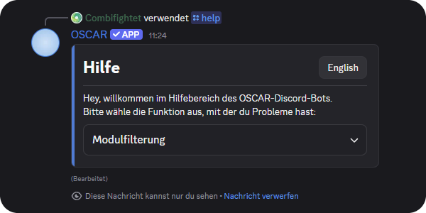

<div align="center">
  
  <h1>OSCAR</h1>
  <p><strong>O</strong>rganized <strong>S</strong>tudy <strong>C</strong>hoice &amp; <strong>A</strong>cademic <strong>R</strong>oadmapper</p>
</div>

[](https://github.com/emin-girimhanov/oscar-discord-bot/actions/workflows/ci.yml)
[](https://emin-girimhanov.github.io/oscar-discord-bot/)

[](LICENSE)

OSCAR is a Discord bot for students of the Faculty of Computer Science (FIN) at
Otto von Guericke University Magdeburg. It brings the module catalogue into Discord,
where students already talk about their studies. It helps with choosing modules and
with planning the first semesters.

**Documentation:** <https://emin-girimhanov.github.io/oscar-discord-bot/>

## What OSCAR does

- **Find modules.** `/module` searches the catalogue by name, in German and English.
  `/filter` narrows it by credit points, exam type, semester and interests.
- **Compare modules.** `/compare` puts two or three modules side by side.
- **Plan semesters.** `/semesterplan` keeps your personal plan and exports it as a
  calendar. `/standard_plan` shows the standard study plan of a programme.
- **Keep track.** `/progress` and `/badges` show how far you are. `/fristen` lists
  the exam registration periods.
- **Learn from others.** `/rate` collects module ratings. `/klausuren` links the past
  exam archives. `/studybuddy` finds a study partner, opt in only.
- **Find the right place.** `/lms` and `/ansprechpartner` point to the right platform
  and the right contact.

`/start` introduces the bot. `/help` explains every command.



## Run it yourself

You need Docker, a Discord bot token and access to the module data.

```bash
git clone https://github.com/emin-girimhanov/oscar-discord-bot.git
cd oscar-discord-bot
cp .env.example .env        # fill in the five values
docker compose up -d --build
docker compose logs -f
```

The log shows `Logged in as ...` when the bot is ready. The bot opens outgoing
connections only. It needs no open port and no university network.
[Run It Yourself](https://emin-girimhanov.github.io/oscar-discord-bot/developer/selfhost/)
explains every step.

> **The module data is not in this repository.** OSCAR reads it from the Nextcloud
> Tables of the faculty at `cloud.ovgu.de`. You need an OVGU account with access to
> that table. Without it the bot has no modules to show.

## About this repository

OSCAR is a supervised student software project at the
[Chair of Simulation](https://www.sim.ovgu.de/sim/en/) of the FIN. The team and the
supervisors are named on the
[About OSCAR](https://emin-girimhanov.github.io/oscar-discord-bot/about_oscar/) page.

The project is developed on the GitLab of the faculty, which needs a university
login. This repository is the public copy of the source code and the documentation.
It starts with a single commit. The earlier history stays on the faculty GitLab.

## Contributing

Bug reports and pull requests are welcome. [CONTRIBUTING.md](CONTRIBUTING.md) explains
the setup, the checks and the commit style. Report security problems as described in
[SECURITY.md](SECURITY.md).

## License

Apache License 2.0, see [LICENSE](LICENSE).

## Bot Setup

> Official Documentation:
> <https://discordpy.readthedocs.io/en/stable/index.html>

### Bot Installation

Just open this authorisation link:

> <https://discord.com/oauth2/authorize?client_id=1549756119033847890&permissions=2147601408&scope=bot+applications.commands>

and follow the steps

### Bot Execution

1. Create a `.env` file and add the required variables (see below)
1. Install all packages with `uv pip install .` (or `pip install .`)
1. Run the bot with `oscar_ovgu`

To run it in a container instead, on your own machine or a home server, see
[`docs/developer/selfhost.md`](docs/developer/selfhost.md). It needs no university
network: the bot only opens outgoing connections, to `discord.com` and `cloud.ovgu.de`.

> **example `.env`:**
>
> ```env
> BOT_TOKEN="MjcyGlUMjDk3OQ..."
> DISCORD_SERVER_ID="123456789"
> TABLES_URL="https://your-nextcloud-instance.de/"
> TABLES_USERNAME="your_username"
> TABLES_PASSWORD="your_password"
> ```

> **Documentation of the faculty instance:** <http://studium-lehre.gitlabpages.cs.ovgu.de/discord-bot>
>
> The link is `http` on purpose. The faculty pages host refuses port 443, so the
> `https` address does not answer at all. Changing it looks like a security fix and
> breaks the link. Only faculty IT can put a certificate there.

### Commands

`/start` names the eight commands you need on day one:

`/start`, `/module`, `/here`, `/filter`, `/compare`, `/semesterplan`, `/my_data`, `/help`

The rest are commands too, and `/help` explains every one of them: `/standard_plan`,
`/progress`, `/badges`, `/cohort`, `/suggest`, `/rate`, `/klausuren`, `/fristen`,
`/lms`, `/ansprechpartner`, `/studybuddy`, `/codegolf`, `/feedback`. Most carry a
German and an English name. `/help` also starts any of them from a menu, for the first
weeks when you do not know the names yet.

Administrators also see `/version` and `/review_feedback`, plus the prefix commands
`!ping` and `!resync`. The short list lives in `src/util/command_surface.py`.

Four portals matter at the OVGU, and all four were checked: **eLearning** (`elearning.ovgu.de`) is the Moodle and holds the course material, **LSF** (`lsf.ovgu.de`) is where an exam registration counts, **BookStack** (`bookstack.cs.ovgu.de`) holds the module handbooks, and the **FIN GitLab** (`isggit3.cs.ovgu.de`) holds the code. OSCAR reads its module data from **Nextcloud Tables** (`cloud.ovgu.de`), which students never open themselves.

The guide with screenshots is in [`docs/features/commands.md`](docs/features/commands.md).


## Good Practices

### Conventional Commits

<https://www.conventionalcommits.org/en/v1.0.0/>

| type       | description | version bump |
|------------|-------------|--------------|
| **`fix`**      | **patched a bug in the codebase** | **PATCH** (e.g., 1.0.0 -> 1.0.1) |
| **`feat`**     | **introduced a new feature to the codebase** | **MINOR** (e.g., 1.0.0 -> 1.1.0) |
| **`feat!`**    | **BREAKING CHANGE (add ! after type)** | **MAJOR** (e.g., 1.0.0 -> 2.0.0) |
| `chore`    | updating grunt tasks etc; no production code change | None |
| `ci`       | changes to CI configuration files and scripts | None |
| `docs`     | changes to documentation | None |
| `style`    | formatting, missing semi colons, etc; no production code change | None |
| `refactor` | refactoring production code, eg. renaming a variable | None |
| `perf`     | code changes that improve performance | None |
| `test`     | adding missing tests, refactoring tests; no production code change | None |
| _and more_ |  | |

**Example commit message:** \
`feat: allow provided config object to extend other configs`

## Project Structure

```bash
discord_bot
 ├─ assets
 ├─ src
 └─ tests
```

### assets

Contains all (graphical and non graphical) assets for the project.

**Current structure:**

```bash
assets
 ├─ images                        # study plan pictures and screenshots
 └─ json
     ├─ semesterplans             # one file per standard study plan
     ├─ bookstack_pages.json      # module number to handbook page
     └─ challenges.json           # weekly code golf algorithmic puzzles
```

`bookstack_pages.json` is generated by `tools/generate_bookstack_map.py`, which needs
the university network. Run it again when the module handbooks change.

### src

Contains source code

**Current structure:**

```bash
src
 ├─ oscar              # actual discord.py bot code
 │   ├─ cogs               # application commands (will be auto loaded)
 │   ├─ ui                 # ui classes (e.g. custom buttons and views)
 │   └─ oscar.py           # the bot itself, command sync lives here
 └─ util               # everything that is not discord
     ├─ tables.py          # the Nextcloud module database & TTL cache
     ├─ module.py          # one module, in both languages
     ├─ semesterplans.py   # the standard study plans
     ├─ plan_image.py      # draws a study plan as a picture
     ├─ bookstack.py       # links into the module handbooks
     ├─ lsf.py             # links into the LSF course search
     ├─ calendar_export.py # RFC 5545 .ics schedule & deadline export
     ├─ database.py        # SQLite storage (WAL mode, indexes, migrations)
     ├─ badges.py          # achievement badges & milestone logic
     ├─ code_golf.py       # weekly challenge rotation & byte counting
     ├─ contacts.py        # faculty & university contact directories
     ├─ deadlines.py       # exam registration & re-registration periods
     ├─ elearning.py       # LMS & platform directory
     ├─ filter.py          # multi-select filtering and sorting
     ├─ module_ratings.py  # peer course reviews & difficulty ratings
     ├─ operators.py       # who may use the admin commands
     ├─ safe_text.py       # makes text a student typed safe to show to others
     ├─ study_buddy.py     # opt-in study buddy matching
     ├─ suggestions.py     # curricular recommendations & topic clusters
     └─ translations.py    # every string the bot says (DE/EN)
```

### tests

Contains unit tests. `tests/conftest.py` puts `src` on the path, so no install is
needed to run them.

```bash
pytest                  # the whole suite
pytest tests/test_module.py -q   # one file
pylint --recursive=y src         # the pipeline requires at least 9.5
```

One test file per area, named after what it covers. The pipeline runs the suite on
every push and refuses a merge when it fails.
