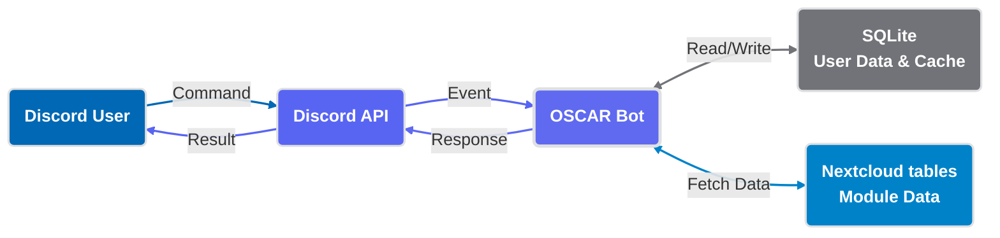

# About OSCAR

  

**OSCAR** (*Organized Study Choice & Academic Roadmapper*) is a supervised software project at the *[Chair of Simulation](https://www.sim.ovgu.de/)* within the [Faculty of Computer Science (FIN)](https://www.fin.ovgu.de/) at [Otto von Guericke University Magdeburg](https://www.ovgu.de/).

---

## **Motivation & Objectives**

Students often struggle to navigate the complex catalog of modules, exam regulations, and prerequisites.

!!! failure "The Problem"
    Planning the first semesters is often inefficient and overwhelming:

    * **Lack of orientation** in the module catalog.
    * **Missing information** about exam types & content.
    * **Scattered data sources** (LSF, [bookstack](https://bookstack.cs.ovgu.de/), PDF).
    * **Inefficient semester planning** leading to suboptimal choices.

!!! success "The Solution"
    OSCAR brings the university's module data directly to **Discord**.

    * ✅ **One Platform:** It is not necessary to switch between Discord (to ask fellow students about modules) and [bookstack](https://bookstack.cs.ovgu.de/).
    * ✅ **Interactive:** Intuitive slash commands and buttons.
    * ✅ **Real-time:** Always synced with faculty data.
    * ✅ **Privacy-Focused:** No behavioral tracking.

### :simple-discord: **Why Discord?**

Instead of building yet another web platform, we chose Discord because:

* **Students are already here** — No need to switch between multiple platforms.
* **Intuitive interaction** — Slash commands and buttons are familiar to users.
* **Real-time delivery** — Information reaches students instantly.
* **Privacy-first** — We don't collect behavioral data or tracking profiles.

### **Project Goals**

* :material-monitor-dashboard: **Visual Information** (Must-Have)
    ---

    Present module and exam information clearly via Discord Embeds, integrated with Nextcloud Tables

* :material-magnify: **Search & Filter** (Must-Have)
    ---

    Enable students to search modules by name or content and filter by Lecturer, exam type, CP, or SWS.

* :material-calendar-edit: **Semester Planning** (Should-Have)
    ---

    Create, save, and modify persistent semester plans linked privately to the Discord User ID.

* :material-star-outline: **Feedback System** (Should-Have)
    ---

    Allow students to anonymously rate modules and OSCAR.

* :material-lightbulb-outline: **Module Recommendations** (Could-Have)
    ---

    Personalized suggestions based on user feedback and historical data to improve course selection.

### **Key Constraints**

| Constraint | Rationale |
| :--- | :--- |
| **No Generative AI** | Deterministic logic ensures reliable, predictable responses. |
| **Discord-Only** | Focused development scope and better user experience. |
| **Faculty Focus (FIN)** | Relevant for core user group; extensible for others later. |
| **Privacy-First** | GDPR-compliant storage using Discord User IDs only. |
| **No LSF Schedule** | LSF data unavailable; clear scope boundaries. |

---

## :material-account-group: The Team

**Project Supervision:**

[Dipl.-Ing. Jana Görs](mailto:jana.goers@ovgu.de) & Prof. Dr.-Ing. habil. Graham Horton from [Chair of Simulation](https://www.sim.ovgu.de/).

* **Christos Lachanas**
     :material-server-network: DevOps & Integration

    API Integration (Bookstack & Tables), CI/CD Pipeline, Containerization, Infrastructure. 

    [:material-email-outline: <a data-email="Y2hyaXN0b3MubGFjaGFuYXNAc3Qub3ZndS5kZQ==" href="#">christos.lachanas [at] st.ovgu.de</a>]

* **Malte Hedrich**
     :material-brush: UX Engineer & Frontend

    Frontend Design, User Experience, Interactive UI Components, Discord Interface. 

    [:material-email-outline: <a data-email="bWFsdGUuaGVkcmljaEBzdC5vdmd1LmRl" href="#">malte.hedrich [at] st.ovgu.de</a>]

* **Malte Heiß**
     :material-database: Backend & Architecture

    Database Schema Design, Backend Logic, Data Models, Core Functionality. 

    [:material-email-outline: <a data-email="bWFsdGUuaGVpc3NAc3Qub3ZndS5kZQ==" href="#">malte.heiss [at] st.ovgu.de</a>]

* **Emin Girimhanov**
     :material-file-document: Backend & Docs

    Backend Development, Documentation, Code Quality Assurance. 

    [:material-email-outline: <a data-email="ZW1pbi5naXJpbWhhbm92QHN0Lm92Z3UuZGU=" href="#">emin.girimhanov [at] st.ovgu.de</a>]

---

## **Roadmap & Timeline**

**Key Milestones**

| Date | Milestone | Status |
| :--- | :--- | :--- |
| **2025-09-18** | Kick-Off & Goal Agreement | :material-check-circle: Completed |
| **2025-12-20** | Interim Presentation (v0.2.0 Beta) | :material-check-circle: Completed |
| **2026-03-01** | Software Freeze | :material-check-circle: Completed |
| **2026-03-05** | Final Presentation & Report | :material-check-circle: Completed |

### **Development Phases**

=== "Phase 1: Setup"
    **September – October 2025**

    * [x] Project initialization and team alignment
    * [x] Discord bot structure and command framework setup
    * [x] Development environment and tooling configuration

=== "Phase 2: API"
    **October – November 2025**

    * [x] Bookstack API integration for module data
    * [x] Nextcloud Tables API connection
    * [x] Data parsing and normalization

=== "Phase 3: Core Features"
    **November – December 2025**

    * [x] Module search and filtering functionality
    * [x] Discord Embed-based information display
    * [x] Interactive semester planning interface
    * [x] User feedback system implementation

=== "Phase 4: Persistence"
    **January – February 2026**

    * [x] Implementation of user feedback (from Beta)
    * [ ] Personalized user module feedback
    * [x] Comprehensive unit testing

=== "Phase 5: Polish"
    **February – March 2026**

    * [x] Finalize documentation for submission
    * [ ] Final Deployment

---

## :material-cogs: **Technical Architecture**

### **Tech Stack**

{{ project_info()}}
{{ show_tech_stack()}}

<strong>OSCAR Bot System Architecture and Data Flow</strong>

This diagram illustrates the seamless interaction between Discord users, the OSCAR Bot backend, and integrated data sources such as SQLite and Nextcloud.

For detailed technical specifications, please [view full Developer Guide](developer/index.md).

### **Data Flow**

1. **Source Data:** Nextcloud Tables maintain current module information (cached locally).
2. **Processing Layer:** Bot parser validates and normalizes incoming data (e.g. CP/SWS regex).
3. **Storage Layer:** SQLite database persists user preferences, semester plans, and feedback.
4. **Presentation Layer:** Discord Views display structured information with pagination.
5. **Interaction Layer:** Students search, filter, plan, and provide feedback via slash commands.

### **Development Approach**

* **Agile Methodology:** Scrum/Kanban-inspired with regular iterations.
* **Version Control:** Git-based workflow using **Conventional Commits** (enforced via `commitlint`).
* **Quality Assurance:** Strict code quality standards via `pylint` (Score ≥ 9.5 required).
* **Continuous Integration:** Automated linting, building, and deployment via GitLab CI/CD.

---

## :material-flash: **Features & User Interface**

=== "Core Commands"

    | Command | Purpose | Status |
    | :--- | :--- | :--- |
    | `/start` | Initial setup (Language, Semester, Major). | :material-check: Ready |
    | `/module` | Display detailed information about a specific module. | :material-check: Ready |
    | `/filter` | Advanced filtering by exam type, CP, SWS, lecturer. | :material-check: Ready |
    | `/semesterplan` | Create and manage personal semester plans. | :material-check: Ready |
    | `/standard_plan` | View curriculum (Regelstudienplan) matching your major. | :material-check: Ready |
    | `/feedback` | Submit ratings and detailed feedback (via Modals). | :material-check: Ready |
    | `/help` | Every command explained, each one can be started from the menu. | :material-check: Ready |
    | `/here` | The module the current channel is named after. | :material-check: Ready |
    | `/compare` | Two or three modules side by side. | :material-check: Ready |
    | `/rate` | Rate a module and read the reviews of other students. | :material-check: Ready |
    | `/klausuren` | Past exam archives of the student councils. | :material-check: Ready |
    | `/progress`, `/badges` | Credit points, milestones and achievements. | :material-check: Ready |
    | `/cohort` | Anonymous comparison with your cohort. | :material-check: Ready |
    | `/suggest` | Modules that fit your programme and open credits. | :material-check: Ready |
    | `/fristen` | Exam registration periods and semester milestones. | :material-check: Ready |
    | `/lms` | The university portals and what each one is for. | :material-check: Ready |
    | `/ansprechpartner` | Dean's office, examination office, student council. | :material-check: Ready |
    | `/studybuddy` | Find students who plan the same module, opt in only. | :material-check: Ready |
    | `/codegolf` | The weekly programming puzzle and its leaderboard. | :material-check: Ready |
    | `/my_data` | See, export and delete what is stored about you. | :material-check: Ready |

=== "Key Features"

    * **Onboarding Flow:** Guided setup for new users.
    * **Module Info:** Rich Discord Embeds with structured data.
    * **Interactive Navigation:** Buttons and dropdowns.
    * **Semester Management:** Interactive view/edit for schedules.
    * **Feedback:** Student ratings for continuous improvement.
    * **Multi-Language:** German and English support.

=== "Implementation Status"

    **Completed**

    * [x] Visual information display (Embeds)
    * [x] Search & Filtering
    * [x] Semester planning
    * [x] Feedback system
    * [x] Bookstack/Nextcloud API integration
    * [x] **Regelstudienplan (Curriculum) Integration**
    * [x] **Advanced Filters (CP, SWS, Curriculum match)**
    * [x] **Category-based Module Discovery**
    * [x] Public documentation

    **Planned for Future**

    * [ ] Production deployment to FIN-Emporium
    * [ ] Personalized recommendations (currently solved via thematic Category filters)

---

## :material-security: **Data Privacy**

OSCAR is designed with **Privacy-First** principles. We collect only the minimum data required.

### **What We Store (Retention Policy)**

All data is stored in a local SQLite database protected by the server infrastructure.

| Data Element | Purpose | Retention |
| :--- | :--- | :--- |
| **Discord User ID** | Unique identifier to link preferences and plans. | Until deletion request. |
| **Study Program & Semester** | Required to filter modules and calculate progress. | Until user changes or deletes. |
| **Semester Plan** | List of modules selected by the student. | Until user changes or deletes. |
| **Feedback** | User ratings and suggestions for improvement. | Pseudonymized (linked to ID) until deletion. |

!!! warning "What we do NOT store"
    ***Real Names:** The database explicitly stores `NULL` instead of usernames.
    * **Message Content:** Chat logs are processed but never persisted in the database.
    ***External Credentials:** Nextcloud access uses a technical service account, not user credentials.
    * **IP Addresses:** Handled entirely by Discord; OSCAR does not log them.

::: src.util.database.Database._check_user
    options:
        show_source: true
        heading_level: 4
        show_root_heading: true
        show_root_full_path: false

**Technical Implementation:**
User data is strictly relational. If your User ID is removed from the system, all associated data (Preferences, Semester Plans, Feedback) is automatically deleted via database constraints (`ON DELETE CASCADE`).

**Your Rights (GDPR):**
You can request information, full deletion, or a copy of your data (JSON format) at any time.

---

## :material-chart-box: **Quality & Challenges**

### **Success Metrics & Standards**

* **User Experience:** Accurate info, quick search, intuitive design.
* **Engineering:** Clean code, test coverage, documented setup.
* **Collaboration:** Transparent communication, clear accountability.

### **Challenges & Solutions**

| Challenge | Approach |
| :--- | :--- |
| **Code Quality** | Linting, conventional commits, and CI/CD enforcement. |
| **Data Inconsistency** | Robust parser to normalize format variations. |
| **UI Complexity** | Focused on MVP core features within Discord limits. |
| **Scaling** | Optimized database queries for large module sets. |

---

---

## :material-clipboard-check: **Validation Report**

The quality and functional integrity of OSCAR were verified through a multi-layered testing strategy, ensuring that all project objectives were met with high reliability.

### **Goal Achievement**

All defined project goals were successfully implemented and validated:

* **Must-Have Goals:** Completed. Module information is clearly displayed via rich embeds, and the advanced search/filtering system (CP, SWS, Exam Type) is fully functional.
* **Should-Have Goals:** Completed. Persistent semester planning is linked to User IDs, and the feedback system (using Discord Modals) is active.
* **Extra Features:** Surpassed expectations. OSCAR includes unplanned features like complex **Regelstudienplan (Curriculum)** integration and thematic category-based module discovery.

### **Testing Strategy**

To ensure software quality, we employed both **Unit** and **Integration** tests, achieving high code coverage and stability.

#### **1. Unit Testing**

We used the `pytest` framework to test individual components in isolation. This allowed us to verify complex logic without side effects.

* **Mocks & Dummies:** We simulated Discord interactions and API responses using `unittest.mock`, ensuring tests run instantly and without an internet connection.
* **Fixtures:** Systematic use of fixtures provided clean, isolated environments for each test (e.g., fresh in-memory SQLite instances).
* **Coverage:** 62 dedicated test cases cover everything from regex-based SWS parsing to complex UI view state transitions.

#### **2. Integration Testing**

Beyond isolated logic, we validated the "glue" between systems:

* **Database Persistence:** Verified that user preferences and semester plans are correctly stored, updated, and deleted (cascading).
* **API Communication:** Scalable tests for the Nextcloud Tables interface ensures that module data is fetched and normalized correctly even when the external source format varies.

#### **3. Static Analysis & Standards**

* **Code Quality:** Enforced a minimum **Pylint score of 9.5/10**.
* **Type Safety:** Validated with `basedpyright` to prevent runtime type errors.
* **CI/CD Integration:** Every commit is automatically validated against the entire test suite and linting rules before being merged.

---

## :material-flag-checkered: **Project Status**

!!! note "Current Status: v1.0.0 (Project Completed)"
    **Date:** March 5, 2026
    The university project phase concluded with the Final Presentation & Report.
    The software surpassed its initial goals by shipping three un-planned extra features (Curriculum Integration, Advanced Filters, Thematic Discovery).

    **Next Steps:**

    1. Open-source handoff for future student generations.
    2. Final deployment to FIN-Emporium production environment.

---

## :material-handshake: **Getting Involved**

* :material-school: **For Students**
    ---

  * Add the bot to your server
  * Use `/feedback` to report issues

* :material-laptop: **For Developers**
    ---

  * Review source code
  * Submit pull requests
  * Add features
  * Help improve documentation

---

## :material-school-outline: **Lessons Learned**

During the 6-month development phase, our team gained valuable insights that go beyond code:

* **Christos (DevOps & API Integration):** Bridging the gap between theoretical DevOps knowledge and real production systems was a huge learning step. The early implementation of our CI/CD pipeline proved that clean infrastructure is the foundation of successful teamwork. In hindsight, more API prototyping during the planning phase would have prevented initial delays.
* **Emin (QA & Docs):** Quality assurance and documentation are not afterthoughts; they must be integral from day one. Developing a methodical approach helped me understand the true value of regular team meetings and preparing for complex shareholder requirements.
* **Malte Hedrich (UX/Frontend):** Navigating the constraints of a Discord bot UI taught me how to combine backend logic and frontend design. Proper Git version control, clear plans, task distribution, and team coordination are just as critical for project success as the code itself.
* **Malte Heiß (Backend/DB):** Choosing SQLite was the right call for our scope. However, establishing a stricter decoupling between frontend and backend early on would have made features (like multi-language support) much easier to scale. This project highlighted how vital structured and clear communication is—both between people and software components.

---

## **Institutions**

[Otto-von-Guericke-University Magdeburg](https://www.ovgu.de/)

[Faculty of Computer Science (FIN)](https://www.fin.ovgu.de/)

[Chair of Simulation](https://www.sim.ovgu.de/)
