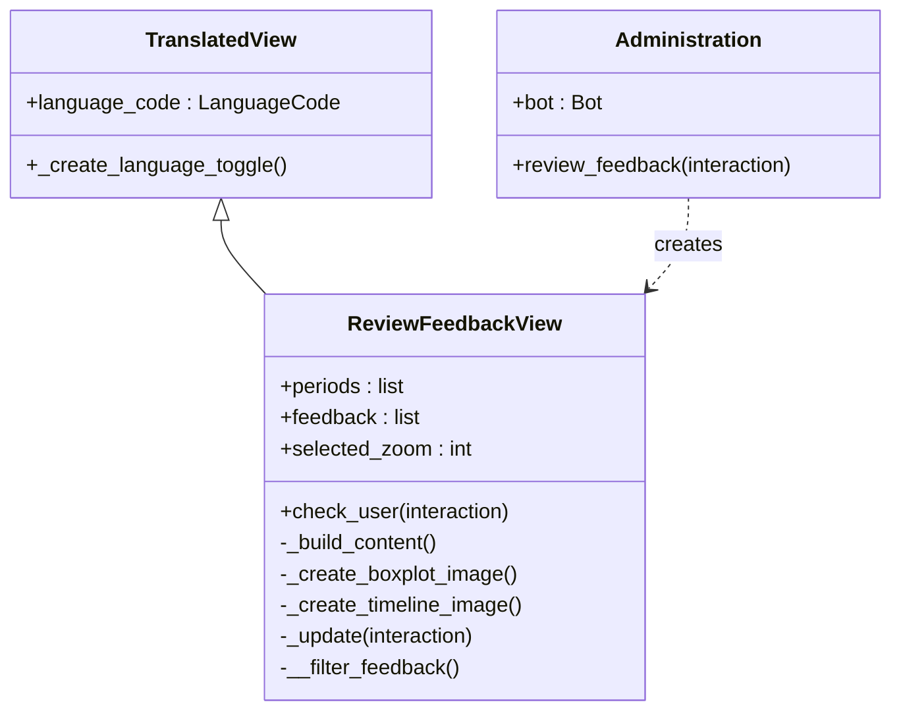

# Administration Cog

This Cog (`src.oscar.cogs.admin`) handles internal maintenance tasks. It is protected by strict permission checks, ensuring only authorized personnel (`DEVELOPER_IDS` or Server Administrators) can access sensitive user feedback.

## Architecture

## Administration Class

The entry point for admin commands. It injects the bot instance and logs the loading process.

::: src.oscar.cogs.admin.Administration
    options:
        show_source: true
        members:
            - review_feedback

## Module Setup

Required function for discord.py to load this extension.

::: src.oscar.cogs.admin.setup
    options:
        show_source: true

## Feedback Review View
The `[ReviewFeedbackView](../ui/feature_views.md)` is an interactive UI that displays statistics and graphs. It inherits from `TranslatedView` to support both English and German interfaces.

**Key Features:**

* **Time Filtering:** Users can filter feedback by periods ranging from "1 Hour" to "All Time". The view dynamically selects up to 5 evenly distributed time intervals to display as buttons.
* **Security:** Interactions are protected via `check_user` to ensure only the command author can control the view.
* **Live Updates:** The graphs (Boxplot & Timeline) are regenerated on-the-fly when filters change.
* **Data Export:** Includes a download button (`⤓`) to export the raw feedback data as a `.json` file.

::: src.oscar.cogs.admin.ReviewFeedbackView
    options:
        show_source: true
        members:
            - __init__
            - check_user
            - _build_content
            - _create_boxplot_image
            - _create_timeline_image
            - _update
            - __filter_feedback

## Helper Functions

::: src.oscar.cogs.admin.is_admin_or_developer
    options:
        show_source: true
