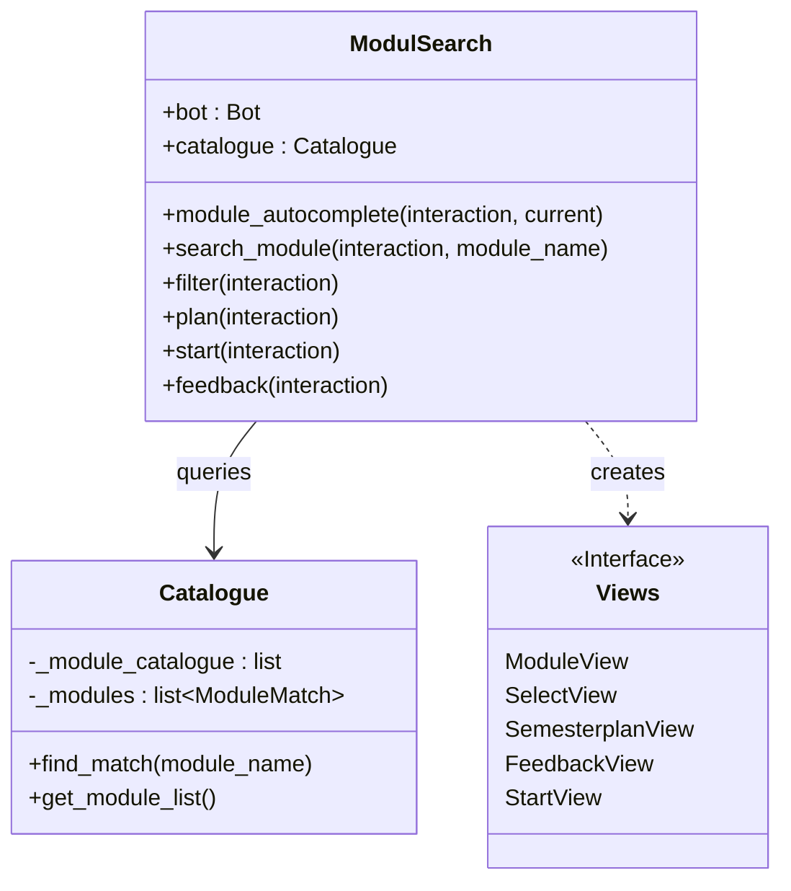

# Module Cogs & Commands

The `ModulSearch` Cog (`src.oscar.cogs.modul`) is the central interaction point. It manages the connection between Discord slash commands and the university module data.

## Architecture

## ModulSearch Class

The class initializes the `Catalogue` (cached module list) on startup using the 2018 view ID to ensure fast data retrieval.

::: src.oscar.cogs.modul.ModulSearch
    options:
        show_source: true
        heading_level: 3
        members:
            - search_module
            - filter
            - plan
            - start
            - feedback

## Module Setup

Required function for discord.py to load this extension.

::: src.oscar.cogs.modul.setup
    options:
        show_source: true

## Technical Implementation Details

### `module_autocomplete`
> **Note:** This is a helper method bound via the `@autocomplete` decorator to the `/module` command.

Provides live suggestions while the user types.

* **Logic:** Uses the `Catalogue` class to perform a **fuzzy search** (via `rapidfuzz`) on cached module titles.
* **Performance:** Limits results to the top **5 matches** to ensure UI responsiveness.
* **Ambiguity:** Some modules share a title. Such an entry shows its id in brackets, for example `Introduction to Simulation (100372)`. A unique title is shown as it is.
* **Value:** Every choice carries the module id as its value. `resolve_module` turns that id back into a module, so a picked entry always opens the module the user saw. A title typed by hand is still looked up with `Module.from_name`.
* **Parameters:**
    * `interaction`: The Discord interaction context.
    * `current` (str): The partial string typed by the user.

### Smart Semester Detection
The commands `/start` and `/feedback` feature automatic context detection. They iterate through the user's roles to find a pattern matching `r"Semester\s+(\d+)"`.

* **Goal:** Pre-fills the semester selection in the UI (e.g., `StartView` or `FeedbackView`) to reduce user friction.
* **Fallback:** If no role matches, the semester defaults to `-1`, prompting a manual selection.

### Command Mapping
| Slash Command | Python Method | View Class |
| :--- | :--- | :--- |
| `/module` | `search_module` | [`ModuleView`](../ui/views.md) |
| `/filter` | `filter` | [`SelectView`](../ui/views.md) |
| `/semesterplan` | `plan` | [`SemesterplanView`](../ui/views.md) |
| `/feedback` | `feedback` | [`FeedbackView`](../ui/views.md) |
| `/start` | `start` | [`StartView`](../ui/views.md) |
