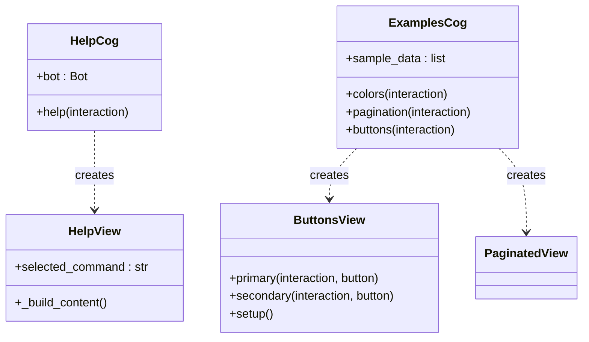

# System Cogs

These Cogs provide general system functionality and help features.

## Architecture

## Help System
The help command (`/help`) opens a dynamic view allowing users to browse different help topics. It fully supports **Internationalization (i18n)**.

The topic list is built from `COMMAND_TEXTS` in `src.util.translations`, keyed by the
real command name, and every entry has an answer behind it in `HELP_ANSWERS`. A test
asserts that both dictionaries hold the same keys, so a command cannot be listed in the
help without an explanation, and the help cannot advertise a command that does not exist.

### The Help Cog

::: src.oscar.cogs.help.Help
    options:
        show_source: true
        heading_level: 3

### Module Setup

::: src.oscar.cogs.help.setup
    options:
        show_source: true

### Help View
The view logic implementing the dropdown menu and language toggle.

::: src.oscar.cogs.help.HelpView
    options:
        show_source: true
        heading_level: 3
        members:
            - __init__
            - _build_content

## Examples
A playground Cog (`src.oscar.cogs.examples`) useful for developers to test UI capabilities and copy-paste reference implementations.

**Included Commands:**
* `/colors`: Displays all valid Discord ANSI color codes for embeds.
* `/pagination`: Generates 64 sample items to test the `PaginatedView` navigation.
* `/buttons`: Displays all button styles (Primary, Secondary, Success, Danger, Link, Premium).

::: src.oscar.cogs.examples.Examples
    options:
        show_source: true
        heading_level: 3

### Module Setup
> **Warning:** This Cog is currently disabled in the code (commented out in `setup`).

::: src.oscar.cogs.examples.setup
    options:
        show_source: true

### Local Helper Classes
Example implementations of UI elements used within the commands above.

::: src.oscar.cogs.examples.ButtonsView
    options:
        show_source: true
        heading_level: 4
        members:
            - primary
            - secondary
            - success
            - danger
            - setup
