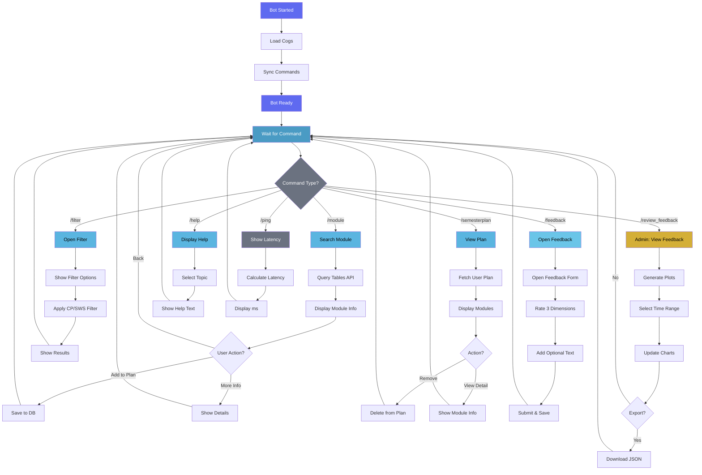

# Bot Core System

The `Oscar` class is the heart of the application. It inherits from `discord.ext.commands.Bot` and orchestrates the startup process, extension loading, and environment configuration.

## The Oscar Class

**Responsibilities:**

1.  **Initialization:** Loads environment variables (`DISCORD_SERVER_ID`, `BOT_TOKEN`) and validates them.
2.  **Extension Loading:** Iterates through the `src.oscar.cogs` package and loads all available modules automatically using `pkgutil`.
3.  **Command Sync:** Synchronizes the Application Command Tree (Slash Commands) with the Discord API upon startup (`on_ready`).

::: src.oscar.oscar.Oscar
    options:
        show_source: true
        heading_level: 3
        members:
            - __init__
            - setup_bot

## Main Entry Point
The `main.py` script serves as the bootstrapper. It configures the `discord.Intents` (specifically enabling `message_content`) and instantiates the `Oscar` bot.

::: src.oscar.main.main
    options:
        show_source: true
