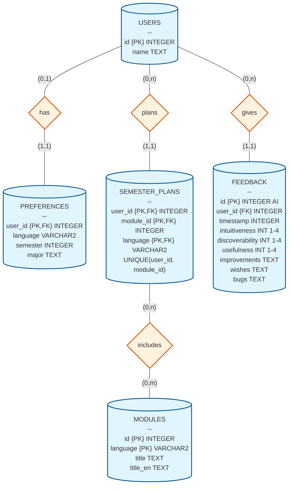

# Database & Persistence

OSCAR stores persistent user data in a local SQLite database (default path: `./database/oscar.db`).
The database layer serves two purposes:

1.  **Persistence:** Storing user preferences, semester plans, and feedback.
2.  **Caching:** Storing module metadata fetched from the Nextcloud API to reduce API calls and enable SQL joins.

### Database Schema

OSCAR uses SQLite (Version 3) with the following main tables:

## Singleton Access
Do not instantiate `Database` directly. Use the singleton accessor to ensure thread safety and a single connection pool.

::: src.util.database.get_database
    options:
        show_source: true

## Data Schema (v6)
The database schema is versioned via `PRAGMA user_version`.

| Table | Description | Key Relationships |
| :--- | :--- | :--- |
| `users` | Stores Discord User IDs. | Primary Key (`id`) |
| `preferences` | User settings (Language, Major, Semester, SPO, Winter/Summer). | FK to `users` |
| `modules` | **Cache** of module definitions (Title, Language). | PK (`id`, `language`) |
| `semester_plans` | Link table for User ↔ Module assignments. | FK to `users`, FK to `modules` |
| `feedback` | Anonymous feedback submissions. | FK to `users` (for rate limiting/spam protection) |
| `study_buddies` | Opt-in module study group matchmaking. | FK to `users` |
| `module_ratings` | Student course evaluations & difficulty ratings. | FK to `users` |

## Public API

### The Database Class
The central interface for all SQL operations.

::: src.util.database.Database
    options:
      show_source: true
      heading_level: 3
      members:
        - __init__
        - set_preferences
        - get_preferences
        - get_users
        - get_module
        - add_to_semesterplan
        - get_semesterplan
        - send_feedback_dict
        - send_feedback
        - get_feedback
        - delete_feedback
        - rate_module
        - get_module_ratings
        - get_user_module_rating
        - get_module_comments

### Manual Documentation overrides

#### `add_module`
> **Hybrid Caching Logic:** This method is polymorphic. If called with just an `int` (ID), it attempts to fetch the module details from the Nextcloud Tables API (`util.tables`) and cache them locally before insertion.

Adds a module to the database.

* **Overloads:**
    * `add_module(module: Module)`
    * `add_module(module_id: int, language: LanguageCode = DE)`: Fetches data from API.
    * `add_module(module_id: int, language: LanguageCode, title: str, title_en: str)`
* **Parameters:**
    * `*args`: Variable arguments based on usage above.

#### `remove_from_semesterplan`
> **Note:** Documented manually due to docstring mismatch in source.

Removes a module from the user's semester plan.

* **Parameters:**
    * `user_id` (int): The user's Discord ID.
    * `module_id` (int): The module's unique ID.

## Helper Functions

### `get_user_language`
A helper function used extensively in UI Views to determine the correct language string (`DE` or `EN`) for a user. Defaults to `EN` if no preference is saved.

::: src.util.database.get_user_language
    options:
        show_source: true
