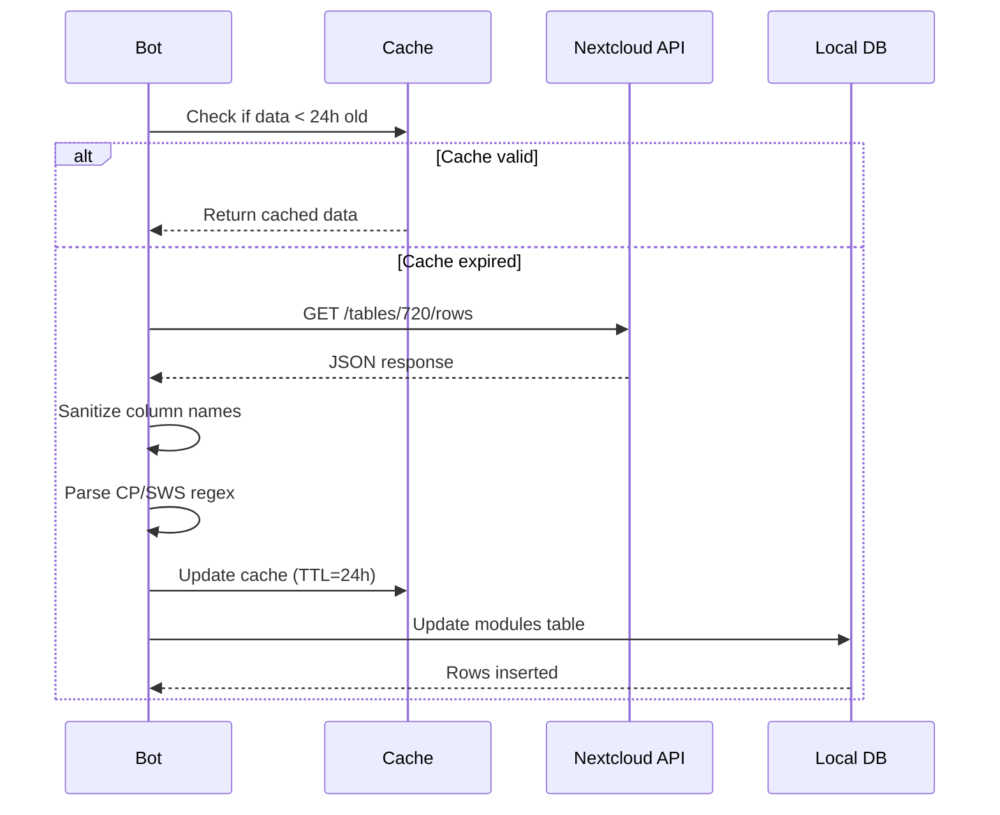

# Data Models & Types

To ensure type safety and consistency across the bot, OSCAR uses strict data models. These define how data flows from the Nextcloud API (`TablesModuleDict`) into the application logic (`Module` class) and finally into the database (`ModuleDict`).

## 1. The Module Class
This class is the core wrapper around university module data. It provides:

* **Abstraction:** Unifies access to attributes regardless of the source (API or DB).
* **Localization:** Implements "Smart Getters" (e.g., `get_title`, `get_content`) that return English translations if available, or fall back to **on-the-fly machine translation** via the `translate` library.
* **Transformation:** Converts the chaotic Nextcloud API keys (e.g., `"Modultitel (englisch)"`) into clean Python attributes (`title_en`).

::: src.util.module.Module
    options:
        show_source: true
        heading_level: 3
        members:
            - __init__
            - from_name
            - from_tables_dict
            - from_dict
            - get_title
            - get_content
            - get_learning_goals
            - get_workload
            - get_usability_bsc_inf
            - get_status

### Factory Methods

#### `from_id`
Creates a `Module` instance by searching the cached catalogue for a specific ID.

* **Parameters:**
    * `id_` (int): The module identification number (e.g., `12345`).
* **Returns:**
    * `Module`: The populated instance.
* **Raises:**
    * `IndexError`: If the ID is not found in the Nextcloud cache.

## 2. Type Definitions (TypedDicts)
We use `TypedDict` to Type-Hint dictionaries that don't warrant a full class.

**Key Distinctions:**

* `TablesModuleDict`: Represents the **raw JSON structure** from the Nextcloud Tables API. Keys are German strings (e.g., `"Credit Points"`).
* `ModuleDict`: Represents the **sanitized structure** stored in the local SQLite database. Keys are English snake_case (e.g., `credit_points`).

::: src.util.typed_dicts
    options:
        show_source: true
        heading_level: 3
        show_root_heading: false

## 3. Core Enums
These Enums define the valid domain values for the application logic.

### LanguageCode
Maps ISO 639 codes to integers for database storage.

* `EN = 0`
* `DE = 1`

::: src.util.enums.LanguageCode
    options:
        show_source: true
        heading_level: 4

### ModuleLanguage
The language a module is **taught** in, which is not the same thing as the language the
bot speaks. The module database has a third value that `LanguageCode` cannot hold.

* `EN = 0`
* `DE = 1`
* `EN_DE = 2` — taught in both

Use `module_language_name()` from `src.util.translations` to render it. It takes the
module language and the user's `LanguageCode`, accepts a raw integer or a stored name,
and falls back to english with a warning for an unknown value, so a new id added in the
database cannot take a view down.

::: src.util.enums.ModuleLanguage
    options:
        show_source: true
        heading_level: 4

### StudyCourse
Enumerates all supported university majors to ensure consistent string matching in the `StartView`.

::: src.util.enums.StudyCourse
    options:
        show_source: true
        heading_level: 4

---

# Nextcloud Tables API Integration

This module (`src.util.tables`) serves as the bridge between the bot and the faculty's Nextcloud instance. It handles authentication, data sanitization, and caching of lookup values.

## Configuration
The connection is established via `requests.auth.HTTPBasicAuth`. Parameters are loaded from environment variables:

* `TABLES_URL`: The base URL of the Nextcloud instance.
* `TABLES_USERNAME`: The user/bot account name.
* `TABLES_PASSWORD`: The app password or user password.

> **Timeout:** Requests typically time out after **30 seconds**.

## Data Fetching (Low-Level)
These functions perform the actual HTTP requests to the Nextcloud Tables API endpoints.

### Row Retrieval
The core function `get_rows_from_view` performs **active data sanitization**. It automatically fixes known typos in the faculty's column headers (e.g., `Modultitel(englisch)` → `Modultitel (englisch)`) to ensure consistent dictionary keys downstream.

::: src.util.tables.get_rows_from_view
    options:
        show_source: true

::: src.util.tables.get_rows
    options:
        show_source: true

### Metadata & Schema
Functions to retrieve structure information, which is essential for dynamic UI generation.

::: src.util.tables.get_table_ids
    options:
        show_source: true

::: src.util.tables.get_scheme
    options:
        show_source: true

::: src.util.tables.get_defaults
    options:
        show_source: true

## Value Resolution & Caching (Smart Lookup)
The API often returns IDs (integers) for selection fields (like "Lehrstuhl" or "Sprache") instead of human-readable strings. The module implements a **Caching-Mechanism** to resolve these IDs efficiently.

* **Global Cache:** Uses `selectionse_dict` to store mappings.
* **TTL (Time To Live):** The cache is only refreshed if it is older than **24 hours** (86400 seconds) to minimize API calls.

::: src.util.tables.get_value_by_id
    options:
        show_source: true

## The Catalogue Wrapper (Fuzzy Search)
A class designed to hold a snapshot of module titles for the autocomplete features.

* **Search Algorithm:** Uses `rapidfuzz.process.extract` for high-performance fuzzy matching.
* **Initialization:** Loads the view (typically ID `2018`) once during startup to reduce latency during user interaction.

::: src.util.tables.Catalogue
    options:
        show_source: true
        members:
            - __init__
            - find_match
            - get_module_list

---

# Internationalization (i18n)

OSCAR is designed to be fully bilingual (German/English). The translation architecture relies on strict typing via Enums and a centralized dictionary storage for static UI elements.

## Core Definition
The `LanguageCode` Enum is used throughout the codebase to ensure type safety when switching languages.

* **ISO 639 Compliance:** Maps `EN` to `0` and `DE` to `1`.
* **Attributes:** Provides helpers like `.values()` and `.from_language_code()`.

::: src.util.enums.LanguageCode
    options:
        show_source: true
        members:
            - from_language_code
            - valid_languages

## Translation Dictionaries
Static UI texts are stored in nested dictionaries: `dict[ContextKey, dict[LanguageCode, TranslatedString]]`.

### General UI Texts
Used for global navigation, onboarding, and command feedback.

::: src.util.translations
    options:
        show_source: true
        members:
            - LANGUAGES
            - START_TEXTS
            - HELP_LANGUAGES
            - STUDY_COURSES

### Feature Specific Texts
Texts used in specific views like Module Details (`AllInfoView`) or Feedback Forms.

::: src.util.translations
    options:
        show_source: true
        members:
            - INFO_TEXTS
            - MODULE_TEXTS
            - FEEDBACK_TEXTS
            - FEEDBACK_REVIEW

## Helper Functions

### The `t` Function
The standard retrieval function used in Views. It safely looks up a key in a dictionary for a given language code.

::: src.util.translations.t
    options:
        show_source: true

### Formatters
Specific helpers to format data types localized.

::: src.util.translations.format_duration
    options:
        show_source: true

## Dynamic Content Translation
Unlike static UI texts, module data (descriptions, learning goals) is stored in the database. The `Module` class implements a hybrid approach:

1.  **Database Lookup:** Checks if a manual English translation exists (`title_en`).
2.  **Fallback (Auto-Translation):** If no translation is found, it uses the `translate` library to generate one on the fly.

> **See:** `src.util.module.Module._get_translation` for implementation details.
