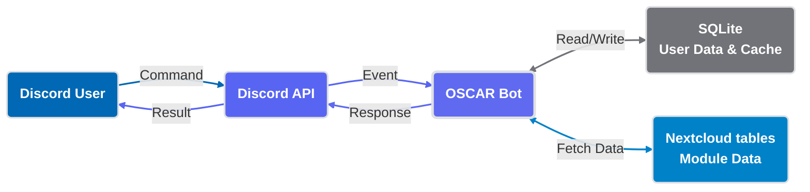
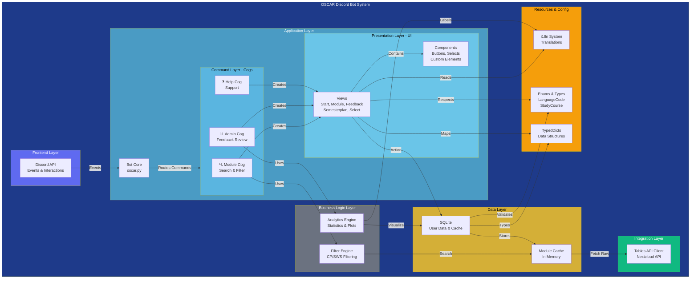

# **Developer Overview**

Welcome to the **OSCAR Bot** developer documentation. This guide helps you understand, set up, and extend the bot.

{{ project_badges_with_links() }}

---

## **Quick Start**

<div class="grid cards" markdown>

- :material-account-plus: **New Contributors**
    ---

    First time here? Start with the **[Setup Guide](setup.md)** to get OSCAR running locally.

- :material-sitemap: **Architecture**
    ---

    Understand how the components fit together.
    [:octicons-arrow-right-24: View System Architecture](core/bot.md)

- :material-database: **Database & Data**
    ---

    Learn about the SQLite schema and Data Models.
    [:octicons-arrow-right-24: View Database Schema](core/database.md)

- :material-shield-account: **Administrators**
    ---

    Need to deploy or maintain?
    [:octicons-arrow-right-24: Admin Guide](../admin/index.md)

</div>

---

## **High-Level Architecture**

OSCAR connects Discord users with University module data. For detailed component diagrams and data flows, see the **[Architecture Guide](core/bot.md)**.





## **Project Structure**

OSCAR is built using `discord.py` and structured into several key components:

``` bash
discord-bot/
├── src/
│   ├── oscar/                   # Bot core
│   │   ├── main.py              # Entry point (sets up intents)
│   │   ├── oscar.py             # Custom Bot class (auto-loads cogs)
│   │   │
│   │   ├── cogs/                # Command handlers
│   │   │   ├── modul.py         # /module, /filter, /semesterplan, /standard_plan
│   │   │   ├── admin.py         # /feedback_review (admin-only)
│   │   │   ├── help.py          # /help (with translations)
│   │   │   └── examples.py      # /colors, /buttons (dev tools)
│   │   │
│   │   └── ui/                  # UI framework
│   │       ├── base_views.py    # TranslatedView, CustomView
│   │       ├── all_info_view.py # Detailed module attributes view
│   │       ├── custom_view.py   # Base class wrapper
│   │       ├── paginated_view.py    # Pagination logic for long lists
│   │       ├── select_button.py     # Selection UI components
│   │       ├── semesterplan_view.py # Semester planning interface
│   │       ├── translated_view.py   # i18n-aware base view
│   │       ├── buttons.py       # Reusable button components
│   │       ├── start_view.py    # /start onboarding
│   │       ├── module_view.py   # Module display card
│   │       ├── select_view.py   # /filter interface
│   │       └── feedback_view.py # /feedback form
│   │
│   └── util/                    # Helper modules
│       ├── database.py          # SQLite wrapper (singleton)
│       ├── tables.py            # Nextcloud API client
│       ├── module.py            # Module data model
│       ├── translations.py      # i18n dictionaries
│       ├── enums.py             # LanguageCode, StudyCourse
│       ├── modules_filter.py    # Filter logic (CP, SWS)
│       ├── typed_dicts.py       # Type definitions
│       └── plots.py             # Matplotlib charts (feedback)
│
├── docs/                        # MkDocs documentation (this site)
├── database/                    # SQLite files (auto-created)
│   └── oscar.db                 # Main database
├── .env                         # Environment config (YOU create)
├── .gitlab-ci.yml               # CI/CD pipeline
├── pyproject.toml               # Dependencies & metadata
└── README.md                    # Project overview
```

## **Tech Stack & Prerequisites**

 We use `pyproject.toml` for dependency management.
??? info "Check pyproject.toml"
    ```toml title="pyproject.toml"
    --8<-- "pyproject.toml"
    ```

| Technology       | Version | Purpose            | Why this choice?                                  |
| ---------------- | ------- | ------------------ | ------------------------------------------------- |
| Python           | 3.12+   | Language           | Modern async/await, type hints, rich ecosystem    |
| discord.py       | Latest  | Discord API        | Most mature & actively maintained Discord library |
| SQLite           | 3.x     | Database           | Zero-config, perfect for caching, ACID compliant  |
| loguru           | Latest  | Logging            | Structured logs, better DX than stdlib logging    |
| matplotlib       | 3.9+    | Visualization      | Admin feedback charts (boxplot, timeline)         |
| basedpyright     | Latest  | Type checking      | Strict typing catches bugs at dev time            |

| Nextcloud Tables | API v1  | Data source        | Faculty's existing module management system       |
| MkDocs Material  | Latest  | Documentation      | Beautiful, searchable, mobile-friendly            |

## **Next Steps**

- [Branch Structure & Git Workflow](workflow.md)
- [Setup](setup.md)
- [Database Internals](core/database.md)
- [Cogs & Commands](cogs/module.md)
- [UI Framework](ui/architecture.md)
- [Admin Overview](../admin/index.md)
