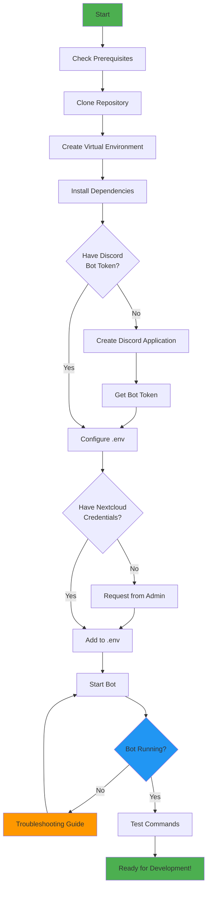

# **Setup OSCAR**



## **Prerequisites**

{{ show_tech_stack()}}

??? info "Check pyproject.toml"
    ```toml title="pyproject.toml"
    --8<-- "pyproject.toml"
    ```

## **1. Clone Repository**

Clone the project from GitLab and switch to the development branch:

```bash
git clone https://github.com/emin-girimhanov/oscar-discord-bot.git discord-bot
cd discord-bot && git checkout develop
```

### **Why develop branch?**

All active development happens on develop. The main branch contains only stable releases.
!!! note
    See [Branch Structure & Git Workflow](workflow.md)

## **2. Create Virtual Environment**

Create an isolated Python environment to avoid dependency conflicts:

```bash
# Linux/macOS (ensure python is 3.12+)
python -m venv .venv
source .venv/bin/activate

# Windows
python -m venv .venv
.venv\Scripts\activate
```

You should see (.venv) in your terminal prompt when activated.

## **3. Install Dependencies**

Install the bot and its development tools:

```bash
pip install -e ".[dev,docs]"
```

### **What gets installed?**

#### Core Dependencies

- **discord-py** - Discord API wrapper for bot interactions
- **loguru** - Structured logging framework
- **python-dotenv** - Environment variable management
- **requests** - HTTP library for Nextcloud API
- **rapidfuzz** - Fast fuzzy string matching (autocomplete)
- **translate** - Automatic translation library
- **matplotlib** - Graph generation (admin feedback charts)
- **numpy** - Numerical operations (for matplotlib)
- **cyclopts** - Entry-point framework for the CLI (`oscar_ovgu`)

#### Documentation Tools (optional [docs])

- **mkdocs-material** - Documentation theme
- **mkdocstrings** - Auto-generate docs from code
- **mkdocs-glightbox** - Image lightbox plugin

Source: pyproject.toml

## **4. Configure Environment Variables**

Create a .env file in the project root:

```bash
cat > .env << 'EOF'
# Discord Bot Configuration
BOT_TOKEN=your_discord_bot_token_here
DISCORD_SERVER_ID=1234567890123456789

# Nextcloud Tables API
TABLES_URL=https://cloud.ovgu.de/apps/tables/
TABLES_USERNAME=bot_account
TABLES_PASSWORD=your_app_password_here
EOF
```

| Variable          | Purpose                    | How to get it                        |
| ----------------- | -------------------------- | ------------------------------------ |
| BOT_TOKEN         | Authenticates bot          | Discord Developer Portal             |
| DISCORD_SERVER_ID | Server where commands sync | Right-click server → Copy ID         |
| TABLES_URL        | API endpoint               | `https://cloud.ovgu.de/apps/tables/` |
| TABLES_USERNAME   | Auth user                  | Nextcloud user account               |
| TABLES_PASSWORD   | App-specific password      | Nextcloud security settings          |

!!! warning
    Never commit the .env file to Git! It's already in .gitignore.

## **5. Discord Bot Application Setup**

### 5.1 Create Application

1. Go to Discord Developer Portal
2. Click "New Application"
3. Enter a name (e.g., OSCAR-Dev-YourName)
4. Accept Discord's Developer Terms of Service
5. Click "Create"

### 5.2 Create Bot User

1. In your application, navigate to "Bot" tab in the left sidebar
2. Click "Add Bot"
3. Confirm by clicking "Yes, do it!"
4. Under "Token" section, click "Reset Token"
5. Copy the token immediately (you can't view it again!)
6. Paste it into your .env file as BOT_TOKEN

!!! warning
    Never share your bot token publicly! It grants full control over your bot.

### 5.3 Enable Required Intents

In the Bot settings, scroll down to "Privileged Gateway Intents" and enable:
✅ MESSAGE CONTENT INTENT (required for command processing)

#### Why is it required?

The bot needs to read message content for the autocomplete feature in module search

### 5.4 Invite Bot to Server

1. In Developer Portal, go to "OAuth2" → "URL Generator"
2. Under "Scopes", select:
   1. bot
   2. applications.commands
3. Under "Bot Permissions", select:
   - Send Messages
   - Read Message History
   - Embed Links
   - Attach Files
4. Copy the Generated URL at the bottom
5. Open the URL in your browser
6. Select your test Discord server
7. Click "Authorize"

#### Create a test server

If you don't have one, create a new Discord server just for development testing.

### 6. Start the Bot

With all configuration complete, start the bot:

```bash
oscar_ovgu
```

#### Expected Output

If successful, you should see:

```bash
2026-03-05 14:00:00 | INFO     | Logged in as: OSCAR-Dev#1234
2026-03-05 14:00:00 | INFO     | Synced 8 commands to guild 1234567890123456789
2026-03-05 14:00:00 | INFO     | Bot is ready!
```

The bot is now running and listening for commands!
