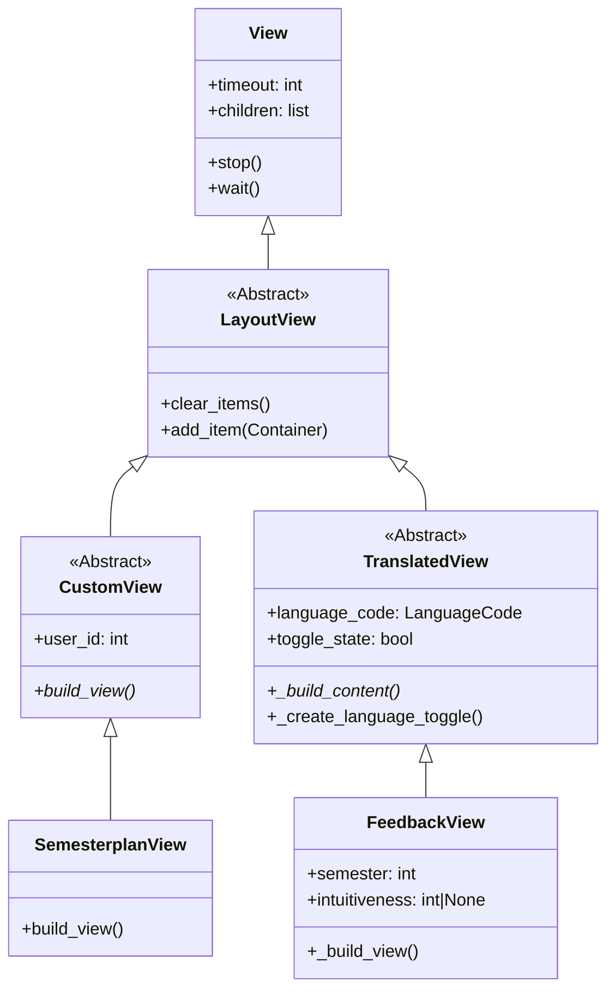
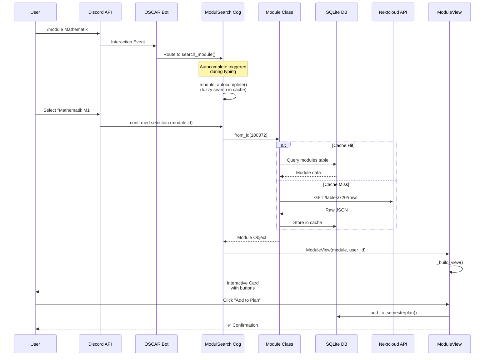
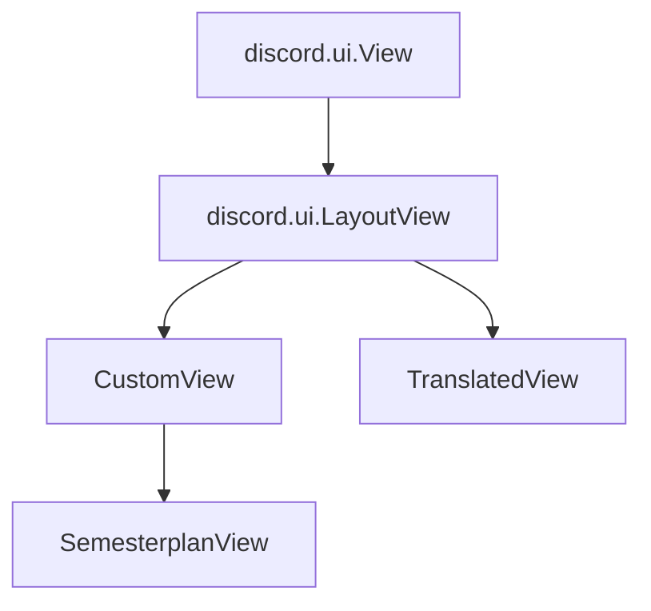

# Architecture & Layer Analysis

The UI framework relies on inheritance to ensure consistent behavior across all views.



## Hierarchy

1. **`discord.ui.View`**: The standard Discord library view.
2. **`LayoutView`** (Custom): Adds layout management capabilities.
3. **`CustomView`**: Adds user-specific context (`user_id`) and an abstract `build_view` method.
4. **`TranslatedView`**: Adds language toggle functionality and state management.

## Interaction Flow

When a user types /module Mathematic, here's the internal workflow:



## Base Class Documentation

::: src.oscar.ui.custom_view.CustomView
    options:
        show_source: true

::: src.oscar.ui.translated_view.TranslatedView
    options:
        show_source: true

## Base Classes

OSCAR uses a set of abstract base classes extending `discord.ui.LayoutView`. These classes standardize how UI elements are built, refreshed, and localized.

### 1. TranslatedView (i18n)

Use this class for views that must support **dynamic language switching** (English/German).

#### Inheritance hierarchy



**Key Behavior:**

* It maintains a `self.language_code` state.
* It automatically handling the interaction when the user clicks the "DE/EN" toggle button.
* **Important:** You must **not** add items in `__init__`. Instead, implement `_build_content()`. The view calls this method automatically whenever the language changes to rebuild the UI.

#### Implementation Guide

1. Inherit from `TranslatedView`.
2. Override `_build_content(self)`.
3. Use `self.language_code` to fetch text from translation dictionaries.
4. Call `self._create_language_toggle()` to add the switch button.

::: src.oscar.ui.translated_view.TranslatedView
    options:
        show_source: true
        heading_level: 3
        members:
            - "**init**"
            - _build_content
            - _create_language_toggle
            - _on_language_change

### 2. CustomView (Dynamic Data)

Use this class for views that are bound to a specific user and data state (e.g., `SemesterplanView`). Unlike `TranslatedView`, it enforces a `user_id` context but leaves language handling up to the implementation (usually via database lookup).

**Key Behavior:**

* Enforces `user_id` in the constructor to ensure database operations can be performed.
* Provides a standardized `build_view()` method that can be called externally (e.g., by a DeleteButton) to refresh the view after data changes.

#### Implementation Guide (CustomView)

1. Inherit from `CustomView`.
2. Pass `user_id` to the super constructor.
3. Implement `build_view(self)` to define your layout.
4. *Optional:* To refresh the view, call `self.build_view()` followed by `interaction.edit_message(view=self)`.

::: src.oscar.ui.custom_view.CustomView
    options:
        show_source: true
        heading_level: 3
        members:
            - "**init**"
            - build_view

### 3. OwnerOnly (who may click)

Mix this into every view that acts on one student's data. It is not optional.

**Why it exists:** each view already stored the `user_id` it was built for, and nothing
ever checked it. `DeleteButton` writes to the id in the **view**, not to the id of
whoever clicked, so while `/semesterplan` answered in the channel, any member of that
channel could empty another student's plan. The selects in `/start` overwrote the same
person's programme.

**Key behavior:**

* discord.py calls `interaction_check` before every component callback. Returning
  `False` stops the callback, so one method covers buttons and selects that do not
  exist yet.
* The refusal is ephemeral and follows `self.language` when the view has one.
* The class using it must set `self.user_id`.

!!! danger "Order matters"
    Write `class MyView(OwnerOnly, LayoutView)`, never the other way round. discord.py's
    own `interaction_check` returns `True` for everybody, so `(LayoutView, OwnerOnly)`
    compiles and silently lets strangers back in. `tests/test_view_ownership.py` pins
    the order for every owned view.

Answering ephemerally is still the first line of defence. Discord does not let anybody
but the recipient interact with an ephemeral message at all.

::: src.oscar.ui.owner_only.OwnerOnly
    options:
        show_source: true
        heading_level: 3
        members:
            - interaction_check

## Comparison Matrix

| Feature | `TranslatedView` | `CustomView` |
| :--- | :--- | :--- |
| **Primary Use Case** | Public/Generic UIs (Help, Feedback Review) | User-specific Data (Semesterplan) |
| **Language State** | Managed automatically via `toggle_state`| Must be fetched from DB per user |
| **Render Method** | `_build_content()` | `build_view()` |
| **User Context** | Optional | Required (`self.user_id`) |

## Create new View

### 1. Create src/oscar/ui/my_view.py

```python
from discord.ui import LayoutView, Container, TextDisplay

from oscar.ui.owner_only import OwnerOnly


# OwnerOnly first, or discord.py's own check wins and everybody may click
class MyView(OwnerOnly, LayoutView):
    def __init__(self, user_id: int):
        super().__init__(timeout=300)
        self.user_id = user_id
        self._build_view()

    def _build_view(self):
        self.add_item(
            Container(
                TextDisplay("# Meine View"),
                TextDisplay("Inhalt hier"),
                accent_color=0x4378d5
            )
        )
```

### 2. Command in Cog: src/oscar/cogs/modul.py

```python
@app_commands.command(name="mycommand")
async def my_command(self, interaction):
    await interaction.response.send_message(
        view=MyView(interaction.user.id),
        ephemeral=True
    )
```


---

## The forty component budget

A discord view holds **40 components and no more**. Over that, discord.py raises
before anything reaches the student:

```text
ValueError: maximum number of children exceeded (40)
```

The student sees *"the application did not respond"*. Nothing on the screen says which
component was one too many, so the view stays broken until somebody runs the command
themselves.

Everything counts: the `Container`, every `TextDisplay`, every `ActionRow`, every
`Button` inside it, and every `Separator`.

### It has happened twice

| View | What grew | Where it stood |
| :--- | :--- | ---: |
| `StartView` | one `TextDisplay` per slash command | crashed past 11 commands |
| `SelectView` | one heading, one row and one button per filter option | 36 of 40, crashed on the 6th group |
| `PaginatedModuleView` | four components per result on a page | 37 of 40, crashed at `per_page=7` |

Both were **views that grow with the data**. A view with a fixed layout is safe. A
view that draws one component per item in a list is a crash waiting for the list to
grow, and the count only moves when somebody adds the item, which is long after the
code was reviewed.

### What to do instead

* **Fold a list into one block of text.** `StartView` builds its command list as a
  single `TextDisplay` with one line per command. Fifty commands cost one component.
* **Spend markdown, not components.** `SelectView` tells its groups apart with a blank
  line inside the heading instead of a `Separator` each. That freed five components,
  and the same trick freed six in the result list.
* **Put the rest behind `/help`.** A menu that starts a feature costs two components
  whatever it holds.

### Measuring

`tests/test_component_budget.py` builds every view that needs no server and reports
its size. `WARN_AT` is 36: a view above it is not broken, it is out of room.

For a view that grows with the data, counting once is not enough. The test has to
**grow the data itself**:

```python
# tests/test_start_view.py
inflated = dict(COMMAND_TEXTS)
for number in range(40):
    inflated[f"invented_{number}"] = {...}
with patch("oscar.ui.start_view.COMMAND_TEXTS", inflated):
    assert children_of(StartView(USER, semester=3)) == before
```

`TestTheFilterMaskHasRoom` does the same with invented `FilterGroup` entries, and
`TestTheResultListHasRoom` raises `per_page` until it would break. Write one of these
for any new view whose size depends on a list or on a number.
