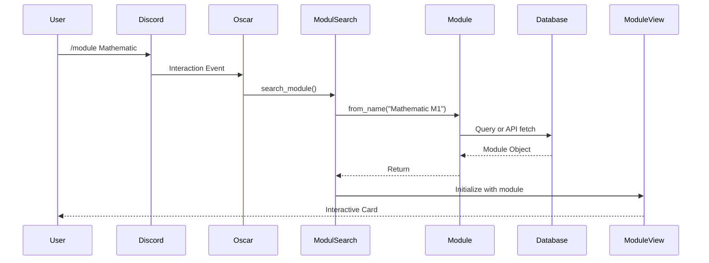

# Feature Views

These views implement specific user interactions and workflows. They often combine multiple UI components like Buttons, Select Menus, and Modals.

## 1. Onboarding (StartView)
The initial onboarding screen (`/start`) where users select their language, semester, and course of study.

**Key Logic:**
*   **Multi-Step Process:** The view dynamically rebuilds itself (`_build_view`) depending on whether language, semester, or major is already set in the state.
*   **Semester Groups:** Uses `SelectButton` instances grouped by `"Semester"`. Clicking one updates the user's preference in the database immediately.
*   **Persistence:** Directly interacts with the `preferences` table via `db.set_preferences` to store the user's major and language.

::: src.oscar.ui.start_view.StartView
    options:
        show_source: true
        heading_level: 3
        members:
            - _build_view
            - callback
            - yes_callback
            - no_callback

## 2. Module Interactions

### Module Summary (ModuleView)
Displays a summary card of a specific module. It serves as the hub for further actions.

*   **Add to Plan:** Adds the module to the user's semester plan via `db.add_to_semesterplan`.
*   **Detailed Info:** Swaps the current message content with an `AllInfoView`.
*   **LSF:** A link button into the public LSF course search, built by `util.lsf`.
*   **Handbook:** A link button into the faculty module handbook, built by `util.bookstack`.
    It points into the reader's own programme when we know it.

::: src.oscar.ui.module_view.ModuleView
    options:
        show_source: true
        heading_level: 3
        members:
            - semester_plan_button_callback
            - info_button_callback

### Comparison (CompareView)
The UI for `/compare`. It puts two or three modules next to each other so a student can
pick one elective out of several without opening three cards.

*   **Layout:** One inline embed field per module. Discord renders three of them in a
    row on a wide screen and stacks them on a phone, which is why `MAX_MODULES` is 3
    rather than a round number.
*   **Rows:** `ROW_KEYS` drives both the values and the headings, so a row cannot be
    added without a translated heading for it.
*   **Footer:** `differing_rows` names the rows the modules disagree on. That is the
    reason for the comparison, so it is said out loud instead of being left to the eye.
*   **Limits:** Titles and values are cut to discord's 256 and 1024 characters. Going
    over makes the whole message fail rather than look untidy.

::: src.oscar.ui.compare_view.CompareView
    options:
        show_source: true
        heading_level: 4
        members:
            - create_embed

::: src.oscar.ui.compare_view.module_rows
    options:
        show_source: true
        heading_level: 4

::: src.oscar.ui.compare_view.differing_rows
    options:
        show_source: true
        heading_level: 4

### Detailed Information (AllInfoView)
Displays the full data of a module (Credits, Lecturer, Content, Learning Goals).
It uses the `Module` class methods (e.g., `get_content(language)`) to fetch localized strings, potentially triggering on-the-fly translation if the requested language is missing in the database.

::: src.oscar.ui.all_info_view.AllInfoView
    options:
        show_source: true
        heading_level: 3
        members:
            - build_view

## 3. Semester Plan (SemesterplanView)
Shows the user's personal semester plan.

**Technical Specifics:**
*   **Inheritance:** Inherits from `CustomView` to support external rebuild triggers.
*   **Dynamic Rebuild:** The `build_view()` method fetches the fresh module list from the database every time it runs.
*   **Interaction:** Uses `DeleteButton`, which calls `self.view_ref.build_view()` on this view to refresh the UI immediately after a module is removed.

::: src.oscar.ui.semesterplan_view.SemesterplanView
    options:
        show_source: true
        heading_level: 3
        members:
            - build_view

## 4. Search & Filter

### Filter Selection (SelectView)
The UI for the `/filter` command. It allows users to combine criteria like CP, SWS, and exam type.

*   **Logic:** It maps button labels (e.g., "<5CP") to `CpFilter` and `SwsFilter` Enums.
*   **Execution:** Upon clicking "Search", it instantiates `ModulesFilter` to process the criteria and transitions to the `PaginatedModuleView` with the results.

::: src.oscar.ui.select_view.SelectView
    options:
        show_source: true
        heading_level: 3
        members:
            - _build_view
            - button_callback

### Filter Results (PaginatedModuleView)
Displays the search/filter results with navigation buttons (`<<`, `<`, `>`, `>>`).
It manages pagination logic (`index`, `per_page`) locally and updates the Embed content dynamically.

::: src.oscar.ui.select_view.PaginatedModuleView
    options:
        show_source: true
        heading_level: 3
        members:
            - _build_page
            - _next
            - _prev

## 5. User Feedback (FeedbackView)

A complex form allowing users to submit ratings and text feedback.

**Components:**
*   **Select Menus:** Three dropdowns for scoring (Intuitiveness, Discoverability, Usefulness). The code maps values (1-4) inversely to the database storage (where 4 might represent the best or worst score depending on the specific scale logic).
*   **Modals:** Buttons trigger the `ImproveModal` to collect text input (Improvements, Wishes, Bugs).

::: src.oscar.ui.feedback_view.FeedbackView
    options:
        show_source: true
        heading_level: 3
        members:
            - _build_view
            - send_callback
            - improve_callback

### Feedback Modal
Helper class (`discord.ui.Modal`) used by `FeedbackView` to capture multi-line text input.

::: src.oscar.ui.feedback_view.ImproveModal
    options:
        show_source: true
        heading_level: 4

## 6. Standard Study Plan (SPlanView)

The UI for `/standard_plan`. Unlike the others it uses the classic embed API rather than
Components V2, because it carries an image attachment.

*   **Picture:** Two programmes have a hand drawn image. Every other plan is rendered
    from its json by `util.plan_image`.
*   **Handbook:** A link button into the programme's own book in the faculty BookStack.

::: src.oscar.ui.splan_view.SPlanView
    options:
        show_source: true
        heading_level: 3
        members:
            - create_embed
            - get_image_file
