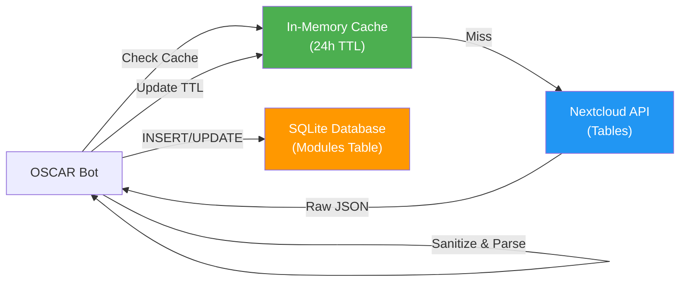

# Nextcloud API Client



This module (`src.util.tables`) manages the connection to the external university module database (Nextcloud Tables).

## The Catalogue Class
Acts as an in-memory cache for the module list to prevent spamming the API with requests for every user interaction.

::: src.util.tables.Catalogue
    options:
        show_source: true
        members:
            - search
            - get_module_by_id

## Data Fetching & Cleaning
Since the external API returns raw user-inputted data, extensive cleaning is performed here.

### Key Repair Logic
The raw JSON keys from Nextcloud often contain typos. The `get_rows_from_view` function normalizes these keys (e.g., mapping various spellings of "Credit Points" to a standard key).

::: src.util.tables.get_rows_from_view


---

## Keeping the cache warm

Reading table 720 takes about a second, and reading the selection labels behind it
another half. Both are plain blocking requests made from inside a command handler, so
the first command after a restart, and the first one after the ten minute cache
expired, held up the **whole bot**:

| | |
| :--- | ---: |
| `/module datenbanken`, cold cache | 1620 ms |
| `/module datenbanken`, warm cache | 5 ms |

Discord gives an interaction three seconds before it tells the student *"the
application did not respond"*. Spending 1620 ms of that on a request that could have
been made earlier is most of the budget, and every other student waits too, because a
blocking request stops the event loop.

`Oscar.keep_tables_warm` runs `util.tables.warm_cache` on a thread at startup and
every `refresh_interval()` seconds after, which is the cache lifetime minus a minute.
One request every nine minutes that nobody waits for.

```python
_ = asyncio.create_task(self.keep_tables_warm())
```

If a round fails the loop keeps going and logs it. A command still works, it just pays
for the cold cache itself.
