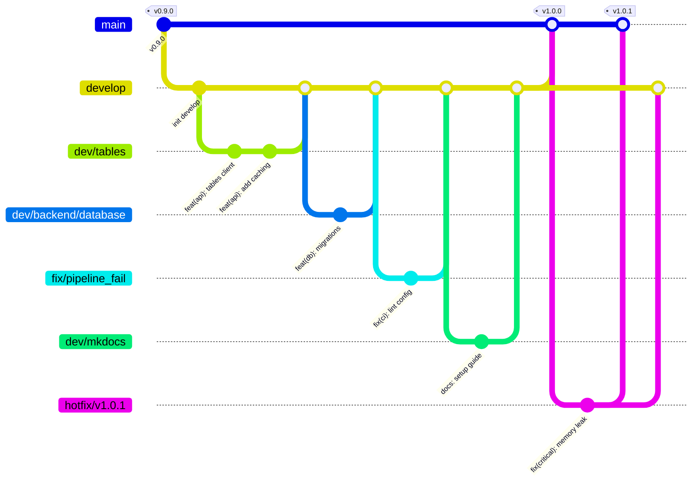
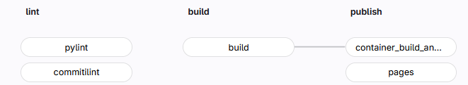

# **Branch Structure & Git Workflow**

This project follows a strict **Gitflow-inspired workflow** to ensure code quality and stability. Our CI/CD pipeline enforces formatting, linting, and commit styles.

---

## **Branching Strategy**

We use a hierarchical branching model. Please adhere to the following naming conventions strictly.



### **Branch Types**

We distinguish between protected integration branches and temporary working branches.

| Prefix | Usage | Example |
| :--- | :--- | :--- |
| **`main`** | **Production Code.** Only stable releases. Deploys to registry with **Production Secrets**. | `main` |
| **`develop`** | **Integration Branch.** All features merge here first. | `develop` |
| **`dev/*`** | **Features.** Implementation of new functionality or sub-projects. | `dev/tables`<br>`dev/backend/database` |
| **`fix/*`** | **Bugfixes.** Corrections for existing bugs. | `fix/pipeline_fail`<br>`fix/login_error` |
| **`hotfix/*`** | **Critical Fixes.** Urgent patches directly on `main`, generating a new patch release. | `hotfix/v1.0.1` |

!!! warning
    Do not push directly to `main` or `develop`. Always use a Merge Request.

---

## **Git Workflow**

### 1. Setup & Sync

Always start your work from the latest `develop` state to avoid conflicts.

See the [Quick Setup Guide](../developer/setup.md) in the developer documentation for installation instructions.

```bash
# Quick refresher:
git checkout develop
git pull origin develop
git checkout -b dev/my-feature-name
```

### 2. Commit Guidelines (Strictly Enforced)

We follow [Conventional Commits](https://www.conventionalcommits.org/). The CI pipeline (`commitlint`) will reject your push if the format is incorrect.

**Format:** `<type>(<scope>): <description>`

| Type | Description | Example |
| :--- | :--- | :--- |
| `feat` | New feature | `feat(ui): add new timetable view` |
| `fix` | Bug fix | `fix(db): resolve connection timeout` |
| `docs` | Documentation only | `docs(readme): update setup steps` |
| `style` | Formatting | `style(lint): fix pylint errors` |
| `refactor` | Code change that fixes no bug/adds no feature | `refactor(auth): simplify login logic` |
| `test` | Adding missing tests | `test(api): add unit test for login` |
| `chore` | Build process, aux tools | `chore(ci): update pipeline image` |

### 3. Quality Checks (Local)

Before pushing, ensure your code passes our strict quality gates locally to save CI time.

* **[pylint](https://pypi.org/project/pylint/)** Must achieve a score of **≥ 9.5**.

    ```bash
    pylint --recursive=y src
    ```

* **Type Checking:** We use [basedpyright](https://pypi.org/project/basedpyright/) (configured in `pyproject.toml`).

??? info "Check pyproject.toml"
    ```toml title="pyproject.toml"
    --8<-- "pyproject.toml"
    ```

### 4. Push & Merge

Push your branch and open a Merge Request targeting `develop`.

---

## **CI/CD Pipeline & Deployment**

The `.gitlab-ci.yml` pipeline handles verification and deployment automatically.

??? info "Check .gitlab-ci.yml"
    ```yaml title=".gitlab-ci.yml"
    --8<-- ".gitlab-ci.yml"
    ```



### Pipeline Stages

1. **Lint (`lint`)**:
    * Runs `pylint` (Fails if score < 9.5).
    * Runs `commitlint` (Checks commit message format).
2. **Build (`build`)**:
    * Builds the Python package (Wheel/Source) and updates `pyproject.toml` metadata.
3. **Publish (`publish`)**:
    * **Container Image:** Builds the OCI image using `buildah` and pushes to the internal OVGU registry (`isggit3.cs.ovgu.de:5050/studium-lehre/discord-bot`).
    * **Documentation:** Builds MkDocs and deploys to GitLab Pages.

### Secret Management & Environments

The build process automatically injects the correct configuration based on the branch:

* **`main` Branch:**
  * Uses **Production Tokens** (`$BOT_TOKEN`).
  * Deploys to the production namespace (`studium-lehre/discord-bot`).
* **Other Branches (e.g., `dev/*`):**
  * Uses **Development Tokens** (`$DEV_BOT_TOKEN`).
  * Safe for testing without affecting the live bot.

> **Note:** The `Containerfile` relies on these secrets being passed via CI/CD environment variables securely during the build and runtime. Do not commit secrets to the repository.

---

## **Automated Releases & Versioning**

OSCAR uses automated Semantic Versioning based on Conventional Commits since the last release tag:

* **`feat`** bumps the **MINOR** version (e.g., `v0.2.0` -> `v0.3.0`).
* **`fix`** or **`perf`** bumps the **PATCH** version (e.g., `v0.2.0` -> `v0.2.1`).
* **`BREAKING CHANGE`** or `!` bumps the **MAJOR** version (e.g., `v0.2.0` -> `v1.0.0`).
* All other commit types (`docs`, `style`, `chore`, etc.) do not trigger a release bump.

### Release Tool (`tools/release_version.py`)

The repository includes a dedicated release tool that inspects Git history:

* **Dry run:**
  ```bash
  python tools/release_version.py
  ```
  Inspects commits since the latest reachable tag and reports the determined bump and next tag without changing files.
* **Applying the bump:**
  ```bash
  python tools/release_version.py --write --env-file release.env --notes-file release_notes.md
  ```
  Updates `pyproject.toml` and writes environment variables (`RELEASE_VERSION`, `RELEASE_TAG`, `RELEASE_BUMP`) for downstream CI jobs.

### Single Source of Truth

`pyproject.toml` is the sole source of truth for the project version. The documentation site dynamically resolves `extra.version` during build time via `docs/main.py` using `get_project_metadata()["version"]`, preventing version drift across documentation and code.

### CI Permissions & Tagging Setup

Automated tag pushes by GitLab CI require the job token to have push permissions:

1. In GitLab under **Settings -> CI/CD -> Token Access**, ensure the project allows write access or configure a Project Access Token with `write_repository` permission stored in CI variable `GITLAB_TOKEN`.
2. The release automation script runs on the default branch (`main`) and refuses to tag on feature branches or when the tag already exists.

---

## **Verification & Functional Validation**

To ensure the project goals (Efficient Planning, Module Discovery, Data Privacy) are met, every feature must be validated against the requirements.

### Automated Tests

*(Automated tests were planned during Phase 4 but ultimately de-scoped for v1.0.0 due to time constraints. The project relies on rigorous manual UI/UX testing).* We aim to eventually add high test coverage in `tests/` to validate:

* **Search Logic:** Does `/module` find the correct entries?
* **Filter Logic:** Does `/filter` return valid subsets?
* **Persistence:** Is the semester plan saved correctly?

### Manual Verification (User Acceptance Testing)

Before merging to `main`, verify the following on the **Test Server**:

1. **Search:** Query known modules (e.g., "Software Project") and check if details match the catalog.
2. **Planning:** Add/Remove modules and restart the bot to ensure data persistence (Privacy/Database check).
3. **Usability:** Ensure interaction flow (buttons/modals) is intuitive.

---

## **Troubleshooting & Common Issues**

### Pre-commit Hooks

If `commitlint` fails, check your commit message format.

```bash
# Good
git commit -m "fix(ui): resolve button misalignment"

# Bad
git commit -m "fixed buttons"
```

### Linting Errors

If `pylint` scores are low:

1. Read the error report (it lists file and line number).
2. Fix the issue (e.g., add missing docstring, rename variable).
3. Run `pylint src/changed_file.py` to verify the fix.

### Local Documentation

To preview documentation changes locally:

```bash
mkdocs serve
# Open http://127.0.0.1:8000
```
