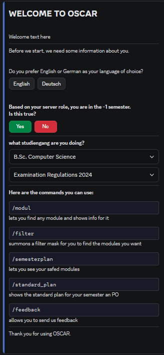
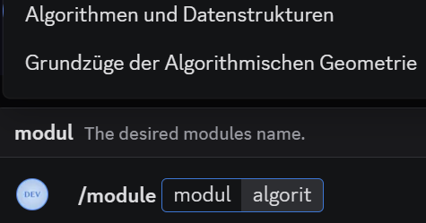
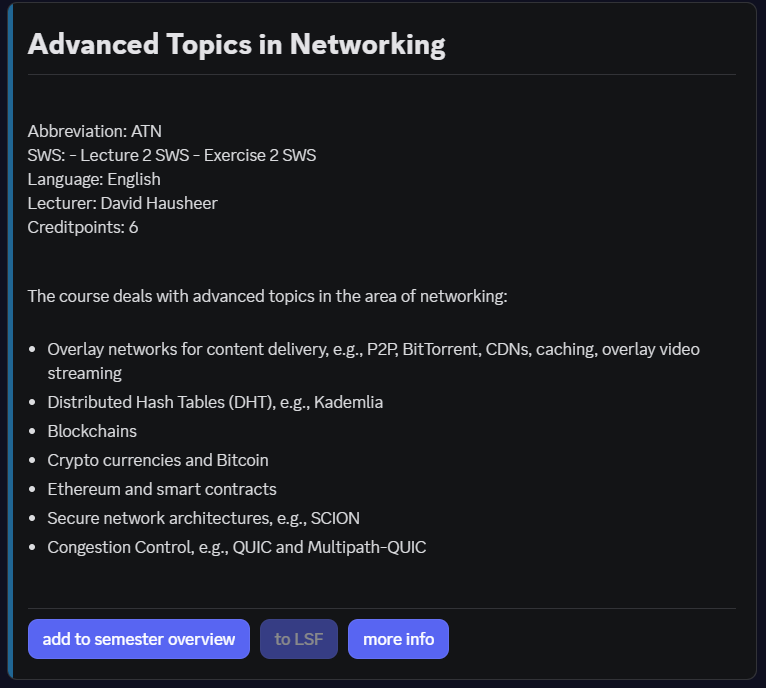
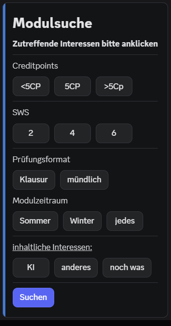
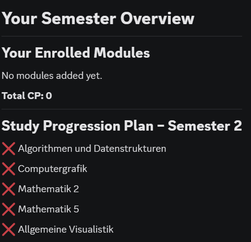
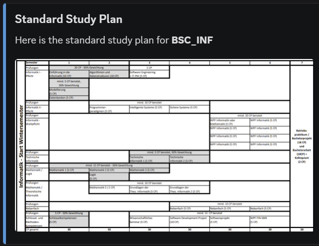
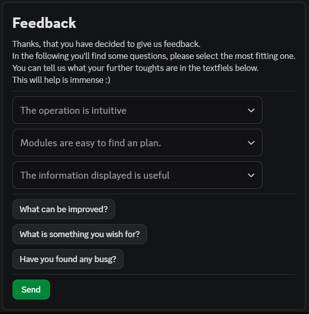
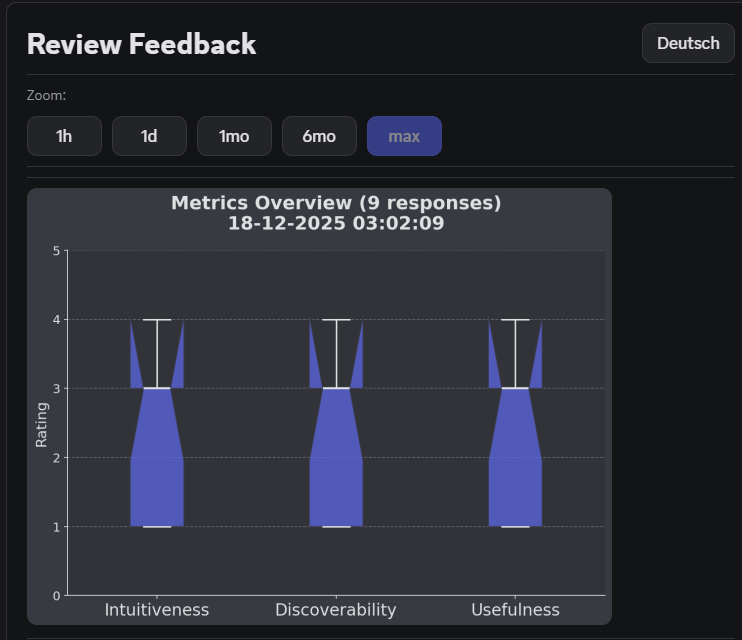

<div class="cmd-hero" markdown="1">

# **Commands Guide**

## **Quick Reference**

| Command | Purpose |
| :--- | :--- |
| `/start` | First-time setup wizard |
| `/module` | Search a module, with autocomplete |
| `/here` | The module this channel is named after |
| `/filter` | Advanced filtering (credit points, language, exam) |
| `/compare` | Put two or three modules side by side |
| `/semesterplan` | Manage your schedule and export an `.ics` calendar |
| `/my_data` | See everything stored about you, and delete it |
| `/help` | Every command explained, plus common questions |

Those eight are the ones `/start` names. Everything else is a command as well:

| Command | Purpose |
| :--- | :--- |
| `/standard_plan` | The official study plan of your programme, as an image |
| `/progress`, `/badges` | Your credit points, milestones and achievements |
| `/cohort` (or `/statistik`) | Anonymous comparison with your cohort |
| `/suggest` (or `/recommend`) | Modules that fit your programme and open credits |
| `/rate` | Rate a module, with an optional written review |
| `/klausuren` | Past exam archives of the student councils |
| `/fristen` (or `/deadlines`) | Examination deadlines and semester milestones |
| `/lms` (or `/elearning`) | The four university portals and what each is for |
| `/ansprechpartner` (or `/contacts`) | Dean's office, examination office, student council |
| `/studybuddy` | Find other students who plan the same module |
| `/codegolf` (or `/challenge`) | The weekly programming puzzle and its leaderboard |
| `/feedback` | Tell us what you think of the bot |

Two more exist for administrators and are hidden from everybody else:
`/version` and `/review_feedback`. `!ping` and `!resync` are prefix commands.

### Why `/start` only names eight

A newcomer cannot learn twenty names at once, and the welcome screen used to try: it
drew one component per command, which pushed it past the forty component limit of a
discord view and made `/start` raise an exception instead of answering.

So `/start` names the eight you need on day one and points at `/help`. `/help` has
three menus:

| Menu | What it does |
| :--- | :--- |
| **Öffnen / Open** | Starts a feature without knowing its command name |
| **Befehl / Command** | Explains any of the commands above |
| **Frage / Question** | Answers what students ask most often |

The short list is `src/util/command_surface.py`, the menu is
`src/oscar/ui/help_launcher.py`. A test refuses any command that `/help` cannot
explain and has no reason to be undocumented.

---

## **Getting Started**

Start your journey here. These commands set up your profile and help you find your way.

```bash
/start
```

### **The Setup Wizard**

Launches an interactive welcome guide designed for first-time users.

* **Sets:** Language (DE/EN), Semester, and Study Program.
* **Why:** Customizes recommendations and planning features for your specific needs.

{ width="400" .img-center }

---

## **Search & Discovery**

Find the modules you need without leaving Discord.

```bash
/module [name]
```

> **Important:** While typing, wait for the **selection options** to appear above the input field. Use these autocomplete suggestions to select your module.

{ width="400" .img-center }
{ width="400" .img-center }

**What it shows:**

* **Stats:** Credit Points (CP), SWH (= Semester Weekly Hours), and Exam Type.
* **Info:** Lecturer, Content, Learning Goals, and Literature.
* **Links:** A button to the module in the **LSF**, and one to the official
  **module handbook** in the faculty BookStack. The handbook link opens the page in the
  book of your own study programme when we know which module it is, and the wiki search
  otherwise.

> **Two modules with the same name?** Some titles exist more than once, for example
> `Introduction to Simulation`. Those entries carry their module number, so
> `Introduction to Simulation (100372)` and `Introduction to Simulation (120345)` are
> two different modules. Every other title stays plain.

**Usage Examples:**
`/module Advanced Topics in Networking`

### **The Module of This Channel**

```bash
/here
```

The server keeps one channel per module. `#algorithmen-und-datenstrukturen` is the
module "Algorithmen und Datenstrukturen", so `/here` reads the channel name and opens
that module card, with its links to LSF, the module handbook, Moodle, the ratings and
the past exams.

* **It asks when it is not sure.** `#datenbanken` is either "Datenbanken 1" or
  "Datenbanken 2", so you get a short dropdown instead of a guess.
* **It says so when it finds nothing.** `#memes` is not a module, and the answer
  points at `/module` rather than opening something at random.
* **In a thread** the parent channel is read, because a thread is named after a
  question and the channel after the module.
* The answer is private, so a module card never fills the channel for everybody else.

### **Smart Search**

Search for a specific module by name using the integrated **Autocomplete** feature.

* **Wait for Options:** The system generates a list of matches (e.g., "Math") as you type.
* **Selection:** Always pick the module from the appearing list to ensure the search processes correctly.
* **Accuracy:** Using suggestions prevents typos and ensures you find the exact entry.

### **Side by Side**

```bash
/compare first: Datenbanken second: Betriebssysteme third: Rechnernetze
```

Use this when you have narrowed an elective down to two or three candidates and have to
pick one. It puts them next to each other instead of making you open three cards and
remember the first.

* **Compared:** credit points, teaching form and SWS, language, exam and lecturer.
* **The footer names what differs**, so you see the deciding row without reading twice.
* **Two or three.** The third module is optional. A fourth would wrap onto a second row
  and stop being a comparison.
* **Each module keeps its handbook button**, so you can read the full description right
  after deciding.

Pick every module from the autocomplete list, the same way `/module` works. Naming the
same module twice is refused, because comparing it with itself says nothing.

### **Advanced Filtering**

Opens an interactive mask of buttons to filter modules according to your criteria.

```bash
/filter
```

{ width="400" .img-center }

* **Multi-selection:** Selecting several buttons in the same row combines them as an **OR** (for example, `< 5 CP` and `5 CP`). Selecting buttons in different rows combines them as an **AND** (for example, `5 CP` and `Written exam`).
* **Sorting:** Above the paginated results, sort buttons allow ordering the list by **Credit Points** (`CP ↑` / `CP ↓`) or by **Title** (`Title A-Z` / `Title Z-A`) without losing your active page.

**Available Filters:**

| Category | Filter Options | Combining Behavior |
| :--- | :--- | :--- |
| **Credit Points** | `< 5 CP`, `5 CP`, `> 5 CP` | Multiple selections in row count as OR |
| **SWH** | `< 3`, `3`, `> 3` | Multiple selections in row count as OR |
| **Exam Type** | Written Exam, Oral Exam | Multiple selections in row count as OR |
| **Semester** | Summer, Winter, Every semester | Multiple selections in row count as OR |
| **Interests** | AI, Computer Games, Systems Engineering, Scientific Computing | Multiple selections in row count as OR |

---

## **Semester Planning**

Your personal digital study coordinator.

```bash
/semesterplan
```

{ width="400" .img-center }

**Your Schedule**
Displays your saved modules grouped by semester.

**Features:**

* **Summary:** View total CP and SWH per semester.
* **Persistent:** Data is saved to your profile (linked to Discord ID).
* **Workload:** Estimates weekly effort based on SWH.

**Workload Management Tips:**

* **Target:** 30 CP per semester.
* **Rule of Thumb:** 1 CP ≈ 25-30 hours total workload (lectures, self-study, exam prep)
→ 30 CP/Semester ≈ 40 hours/week

**How to manage:**

1. **Add:** Use `/module` search and click "Add to Plan".
2. **View:** Run `/semesterplan` to see the overview.
3. **Remove:** Press the `X` next to a module. `more info` opens its card again.
4. **Export Calendar (`.ics`):** Click the **📅 Kalender (.ics, ohne Zeiten)** button to receive a standard iCalendar file with your enrolled modules, BookStack links, and official FIN examination deadlines.

---

### **Official Curriculum Integration**

View your degree's officially recommended path.

```bash
/standard_plan
```

Or, if you do not know the name yet: `/help → Öffnen → Regelstudienplan`.

* **Purpose:** See exactly which modules the university expects you to take in the current semester based on your saved major.
* **Progress Marking:** When you have modules saved in your semester plan, `/standard_plan` compares your saved modules against the curriculum. A checkmark (`✅`) indicates a module is in your plan, while an open box (`⬜`) marks open requirements. Total and per-semester planned credit points are summarized.
* **Elective Matching:** Elective slots (`WPF`) are automatically matched against your saved modules using degree-specific usability rules.
* **Note on Grades:** OSCAR does not track grades; checkmarks mean a module is planned in your schedule, not that it was passed.
* **Picture:** Every plan is shown as a picture, one column per semester, with the
  credit total in each heading. When progress is tracked, the rendered plan highlights your progress. Pale boxes are electives, where you pick a module
  yourself.
* **Handbook:** A button opens the official module handbook of your study programme.
* **Coverage:** All eight plans are available, for a winter start and for a summer
  start. If your programme has none yet, the bot says so instead of showing a wrong one.

> **Set it up first.** `/standard_plan` needs your study programme and your examination
> regulations. Run `/start` if you have not yet. It answers privately (`ephemeral`) to keep your curriculum progress to yourself.

{ width="400" .img-center }

---

### **Study Buddies & Study Groups**

Find other students who plan the same module and form study groups.

```text
/module → 👥 Lerngruppe        (button on the module card)
```

* **Privacy by Default:** Your semester plan is completely private. Other students only see you if you explicitly click **✅ Als Lernpartner:in eintragen** for that module.
* **Anonymous Statistics:** View how many students plan the module in their schedule and how many are looking for study buddies.
* **Revocable:** Opt out at any time with a single click (**❌ Austragen**).
* **Private Study Threads:** Once matched, create a dedicated Discord thread (**🧵 Thread erstellen**) with one click, pinging all opted-in participants.
* **Direct Access:** Also available via the **👥 Lerngruppe** button directly on every module card in `/module`.

---

## **Feedback & Ratings**

Help us improve OSCAR and support peer students in course selection.

```bash
/feedback
```

Or, if you do not know the name yet: `/help → Öffnen → Feedback zum Bot`.

{ width="400" .img-center }

**Rate the Bot**
Opens a structured form to evaluate your experience with OSCAR.

**Rating Metrics (Scale 1-4):**

1. **Intuitiveness:** Is the bot easy to use?
2. **Discoverability:** Can you find modules easily?
3. **Usefulness:** Is the provided information helpful?

*Optional text fields allow you to report bugs or suggest features.*

### **Module Ratings & Reviews**

```text
/module → ⭐ Bewerten          write one
/module → 💬 Erfahrungen       read the others
```

* **Rate Modules (1–5 Stars):** Evaluate courses you have attended to help fellow students plan their studies.
* **Difficulty Assessment (1–5):** Provide insight into whether workload and exam difficulty are low or high.
* **Advice & Tips:** The comment field is optional and is the part that actually helps
  the next student.
* **Reading them:** The module card quotes the newest review under the averages and
  counts the rest. **💬 Erfahrungen** opens the five most recent in full, each with its
  stars, its difficulty and the date.
* **No names.** A review is shown without an author. The table stores a discord id so
  that one student can only rate a module once, not to attribute the text. Delete your
  own with `/my_data`.

!!! note "This was broken until 2026-09-17"
    `/rate` asked for a review from the first day, stored it, and displayed it nowhere.
    `Database.get_module_comments` existed and nothing called it, so every tip written
    went into the database and was never read.

### **Past Exam Archives (Altklausuren)**

```bash
/klausuren
```

Or, if you do not know the name yet: `/help → Öffnen → Altklausuren`.

Every faculty runs its own archive, so the command lists all of them with one link
button each. A Wirtschaftsinformatik student writes exams at the FWW, and every
programme contains maths from the FMA.

| Student council | Faculty | What you find there |
| :--- | :--- | :--- |
| [FaRaFIN](https://farafin.de/dienste/klausuren/) | Computer Science (FIN) | Every CS module, plus written recollections of oral exams |
| [FaraWiwi](https://www.farawiwi.ovgu.de/Klausuren.html) | Economics and Management (FWW) | Business studies, economics and statistics, split by degree |
| [FaraMath](https://www.faramath.ovgu.de/Ged%C3%A4chtnisprotokolle/Archiv.html) | Mathematics (FMA) | Recollections for the maths modules, by subject and examiner |

* **OSCAR hosts nothing.** The copyright on an exam paper sits with the chair, not
  with the student who wrote it. Issue #43 settled that: link, never host.
* **Direct access:** every module card carries a **`📚 Altklausuren`** button to the
  FaRaFIN archive.
* `klausuren.farafin.de` used to be the one address OSCAR showed. That host stopped
  resolving, so the button led into a connection error. The addresses now live in
  `src/util/exams.py`, and a test keeps the dead one from coming back.


---

## **Your Own Data**

```bash
/my_data
```

Shows you everything the bot stores about you: your Discord id, your language, semester,
programme and examination regulations, the modules you saved, and any feedback you sent.

Two buttons sit under it:

* **Download** hands the same data over as a JSON file you can keep. The summary above
  is shortened for reading; the file holds every row, including the free text of your
  feedback.
* **Delete** removes all of it. It asks first, and the question names how many modules
  and how many feedback entries disappear, because a semester plan is an afternoon of
  work and there is no undo.

The whole conversation is private. Nobody else in the channel sees it or can click it.

Deleting does not lock you out. Running `/start` again simply creates a new, empty
record.

!!! note "Why this exists"
    It is closer to an obligation than a feature. The privacy policy has always promised
    you the right to see and delete your data, and section 6.5 already spoke of a bot
    command. Now there is one.

---

## **Contacts & Faculty Support**

Access verified faculty and university contact persons without digging through outdated university web pages.

```bash
/ansprechpartner
/contacts
```

Or, if you do not know the name yet: `/help → Öffnen → Ansprechpartner`.

* **Studiendekanat & Prüfungsamt (PA):** Exam registration, grade recording, medical notes, and study regulations.
* **Student Council (FaRaFIN) & E-Wochen Portal:** Student representation, past exam archives, and the official Freshman Orientation Weeks portal ([eet.farafin.de](https://eet.farafin.de)) with schedule workshops and campus rally.
* **Programme Directors (Fachberatung):** Academic counseling for B.Sc./M.Sc. INF, IngInf, WIF, CV/VC, DKE, and DE.
* **Germany Scholarship & BAföG:** Application deadlines, €300/month scholarship guidance, and Studentenwerk social counseling.
* **Internship, Exchange & Support Internationals:** FIN Internship Office, Erasmus study abroad, and **Support Internationals / DAAD FIT** (career pathways, integration, and International Buddy Programme at the International Office).
* **Counseling & Diversity:** Psychosocial Student Counseling (PSB) for exam stress/mental health and the Equal Opportunity Officer.
* **Interactive UI:** Switch categories dynamically via a dropdown menu, visit faculty portals via direct link buttons, and toggle between German and English.

---

## **Learning Platforms & LMS Guide**

Navigate the faculty's digital learning management systems without getting lost between university accounts and CS accounts.

```bash
/lms
/elearning
```

Or, if you do not know the name yet: `/help → Öffnen → Lernplattformen`.

* **Platform Breakdown:** The four portals that exist: **eLearning** (the Moodle), **LSF**, the **BookStack** module handbook and the **FIN GitLab**.
* **Account Guidance:** Clarifies which portal requires a personal FIN account vs. your central university account.
* **Exam Registration Notice:** Explains the vital difference between Moodle course enrollment and binding exam registration on LSF.
* **Direct Links:** Interactive dropdown menu with direct browser launcher buttons for all platforms.

---

## **Personal Progress & Badges**

Track your academic journey and celebrate semester milestones with privacy-first gamification.

```bash
/progress
/badges
/cohort [studiengang] [semester]
/statistik
```

Or, if you do not know the name yet: `/help → Öffnen → Fortschritt & Badges`.

* **Personal Workload Bar:** Tracks your planned credit points against the recommended 30 CP semester load (e.g. `[████████░░] 80%`).
* **Achievement Badges:**
    * 🎯 **Ready to Go (Startklar):** Set up your study profile via `/start`.
    * 📌 **First Steps (Erste Schritte):** Save your first module to `/semesterplan`.
    * 📝 **On Track (Auf Kurs):** Plan 15+ Credit Points.
    * ⚖️ **Semester Master (Semestermeister):** Complete a full 30 CP semester load.
    * 🚀 **Power Planner (Power-Planer):** Plan 45+ CP or 8+ modules.
    * 👥 **Team Player (Teamplayer):** Join a study group via `/studybuddy`.
    * 🌐 **Polyglot (Polyglott):** Plan courses taught in both German and English.
    * 💬 **OSCAR Patron (OSCAR-Pate):** Provide valuable feedback to improve the bot.
    * ⛳ **Code Golfer (Code-Golfer):** Submit a solution to a weekly code golf challenge.
* **Privacy by Design:** As described in Issue #48, personal progress metrics are strictly private (`ephemeral=True`). No cohort surveillance or ranking lists.

---

## **Weekly Code Golf Challenge**

Test your programming and code-minification skills in weekly algorithmic challenges.

```bash
/codegolf [nummer] [rangliste]
/challenge
```

Or, if you do not know the name yet: `/help → Öffnen → Code Golf`.

* **Weekly Rotation:** Predictable cycle through 10 curated programming puzzles rotating with each ISO calendar week.
* **Shortest Code Wins:** Measured in UTF-8 byte length (excluding outer markdown code blocks and whitespace).
* **Live Leaderboards:** Real-time top 10 rankings per challenge sorted by byte length ascending.
* **Host Safety First:** Secure static metric evaluation without executing untrusted code on the host process.
* **Language Agnostic:** Submit in Python, C, Rust, JavaScript, Haskell, or any language of your choice.

---

## **Deadlines & Exam Periods**

Never miss an exam registration or re-registration deadline again.

```bash
/fristen
/deadlines
```

Or, if you do not know the name yet: `/help → Öffnen → Fristen & Termine`.

* **Active Countdown:** Highlights the next impending deadline (e.g. `🚨 Last day today!` or `🟡 In 5 days`).
* **Official FIN Dates:**
    * **Prüfungsanmeldung (Exam Registration LSF):** 15.11.–30.11. (WiSe) / 15.05.–31.05. (SoSe).
    * **Rückmeldung (Re-registration):** 15.01.–15.02. (WiSe) / 15.06.–15.07. (SoSe).
    * **Lecture & Exam Periods:** Complete dates for course blocks and exam weeks.
* **3-Day Withdrawal Policy:** Reminder that exams can be deregistered in LSF up to 3 days prior without stating reasons.
* **Quick Links:** One-click navigation to the LSF exam portal and the FIN Examination Office.

---

## **Module Suggestions & Recommendations**

Discover fitting electives and modules tailored to your study programme and interests without endless catalog browsing.

```bash
/suggest [category]
/recommend
```

Or, if you do not know the name yet: `/help → Öffnen → Modul-Empfehlungen`.

* **Tailored Fit:** Factors in your current study programme (e.g. B.Sc. Informatik, B.Sc. Computervisualistik), your current semester, and excludes modules already in your `/semesterplan`.
* **Topic Clusters:** Filter suggestions by specialized focus areas:
    * 🤖 **Künstliche Intelligenz (KI / AI):** Machine Learning, Deep Learning, Natural Language Processing, Computer Vision.
    * 🎮 **Computergrafik & Digitale Spiele:** 3D Graphics, Rendering, Game Design, Virtual/Augmented Reality.
    * 💻 **Software & Systems Engineering:** Software Architecture, Testing, Databases, Clean Code, Compiler Construction.
    * 🔬 **Wissenschaftliches Rechnen:** High-Performance Computing, Numerical Simulation, Stochastics.
    * 🎯 **Passend zum Studiengang:** Broad elective recommendations matching your degree's usability requirements.
* **Direct Save:** Add suggested modules directly to your personal semester plan via an interactive dropdown.
* **Explainable Proposals:** Every proposal explains *why* it was suggested (e.g. `Eligible in B.Sc. Informatik • Recommended for semester 4`).

### **Progress & Cohort Analytics**

Track personal study progress, earn gamification badges, and benchmark your workload with fellow students:

```bash
/progress
/badges
/cohort [studiengang] [semester]
/statistik
```

Or, if you do not know the name yet: `/help → Öffnen → Fortschritt & Badges`.

* **Personal Milestones:** Visual 30-CP progress bar, milestone tracking, and gamification achievements.
* **Cohort Statistics:** A button inside the same view switches to the anonymous workload comparison (average planned modules, average CP, and top planned courses) within your degree programme and semester.
* **Privacy by Design:** Enforces strict $k \ge 3$ k-anonymity to prevent individual student fingerprinting.
* **Interactive Toggle:** Switch back and forth between your personal progress and cohort statistics with a single click.

---

## **Admin Commands**

Commands for maintenance and analysis.

**Feedback Dashboard**
Visualizes user feedback with charts.

```bash
/review_feedback
```

{ width="400" .img-center }

* **Charts:** Boxplots (Metrics) & Timelines (Trends).
* **Features:** Filter by time range (1h, 1w, All Time), Export JSON.
* **Permission:** Admin or Developer only.

**Health Check**
Checks the latency to the Discord API.

```bash
!ping
```

* **Output:** `Latency is 42ms ✅`
* **Use:** Verify if the bot is online and responsive.

**Force Sync**
Manually synchronizes the Slash Commands with Discord.

```bash
!resync
```

* **Use:** If new commands aren't showing up or options are outdated.

---

## **Workflow & Best Practices**

### 1. The "New Semester" Routine

1. **Update Profile:** Run `/start` if your semester has changed.
2. **Filter:** Use `/filter` to find "English" modules with "5 CP".
3. **Inspect:** Use `/module` to check exam regulations.
4. **Plan:** Add candidates to `/semesterplan` and check if you reach ~30 CP.
5. **Compare:** Use `/standard_plan` to verify you aren't missing critical mandatory courses.

### 2. Search Effectiveness

* ✅ **Do:** Use partial names ("Data") and wait for autocomplete.
* ✅ **Do:** Search via `/filter` if you don't know the exact name.
* ❌ **Don't:** Type full names with typos; let the bot suggest it for you.

---

## **Troubleshooting**

  [View FAQ](../features/faq.md){ .md-button .md-button--primary }

</div>
