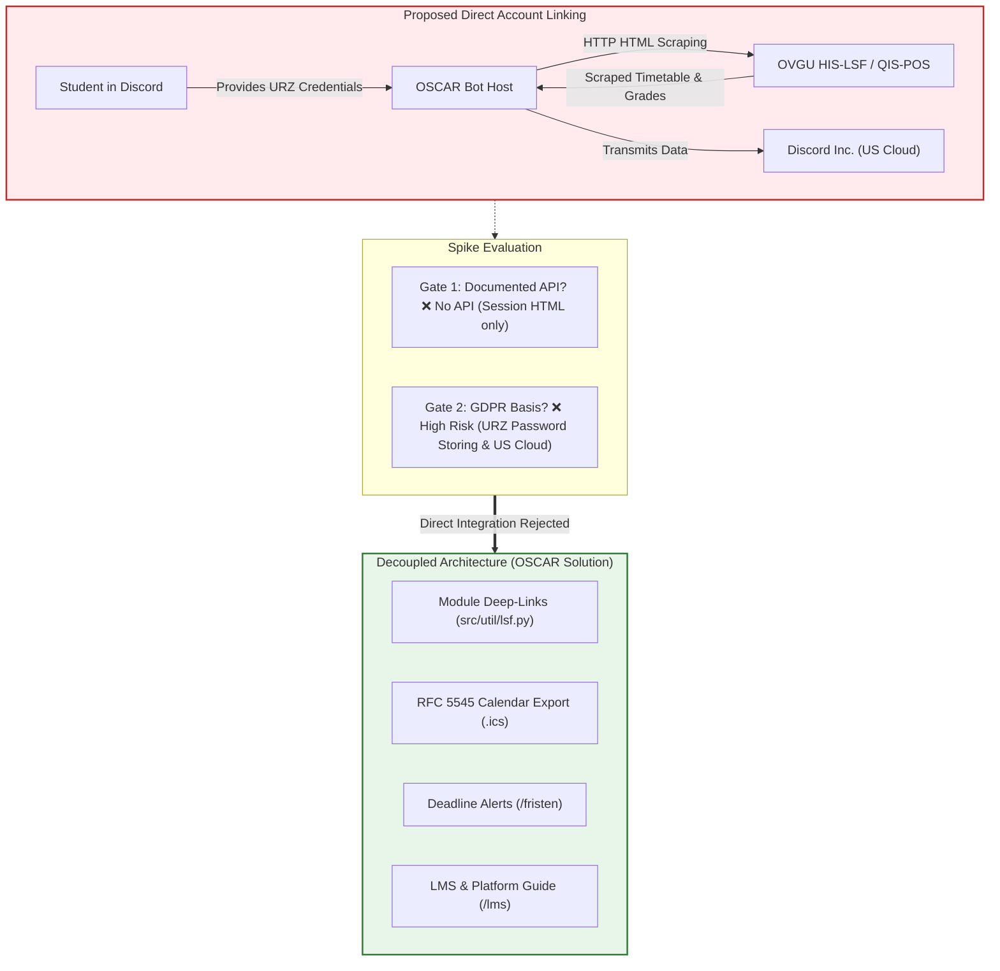

# Feasibility Spike: LSF, UniNow & Studo Integration

## 1. Executive Summary

This feasibility spike evaluates the technical viability, security risks, and data protection implications of directly integrating the Otto von Guericke University Magdeburg (OVGU) **LSF** (*Lehre, Studium, Forschung* / HIS system) or third-party campus aggregators (**UniNow**, **Studo**) into the OSCAR Discord bot (**[Issue #12](https://isggit3.cs.ovgu.de/studium-lehre/discord-bot/-/issues/12)**).

The issue formulated two mandatory gates before any integration could proceed:
1. **A documented interface** (an official, stable, machine-readable API).
2. **A data protection basis** (GDPR compliance, lawful processing of student credentials and grades on third-party cloud infrastructure).

### 1.1 Campus Platform Ecosystem
At OVGU and the Faculty of Computer Science (FIN), digital services are divided into two clear operational tiers:
* **Primary Everyday Systems:**
    * **LSF (`lsf.ovgu.de`):** Primary system for legal course registrations, exam registrations and grade reporting.
    * **eLearning / Moodle (`elearning.ovgu.de`):** The primary system for day-to-day lecture materials, homework sheets, and class communication.
* **Curriculum & Handbook Systems:**
    * **BookStack (`bookstack.cs.ovgu.de`):** The faculty's official digital module handbook containing degree regulations and course descriptions.
    * **Nextcloud Tables (`cloud.ovgu.de`):** Structured database of all FIN modules used as the headless data source for OSCAR.

### Architectural Verdict
* **Direct Integration:** **REJECTED / OUT OF SCOPE**. Scraping student credentials and transmitting personal academic records via Discord violates fundamental security best practices and university IT regulations, and lacks a legal basis under GDPR.
* **Alternative Solution:** **IMPLEMENTED**. OSCAR implements a decoupled, zero-credential architecture combining public LSF deep-links (`src/util/lsf.py`), standard RFC 5545 calendar export (`src/util/calendar_export.py`), and examination deadline monitoring (`/fristen`).

---

## 2. Technical Evaluation

### 2.1 OVGU LSF (HIS-LSF / QIS-POS)
The university's course catalog and exam registration system is based on HIS-LSF:

* **Lack of REST / GraphQL API:** The HIS-LSF deployment provides no public machine-readable API or OAuth2 authorization server for third-party client integrations.
* **Fragile HTML Session Scraping:** Access to non-public endpoints (timetables, registered exams, grades) requires authenticating a session via cookie management, CSRF tokens, and stateful URL query parameters (`state=wsearchv`, `asi=...`). Screen scrapers break frequently upon minor template updates, resulting in high maintenance overhead.
* **No Persistent Stable Identifiers:** LSF courses lack persistent foreign keys aligned with the Faculty of Computer Science module database (Nextcloud Tables). Module titles often vary slightly between systems (e.g. abbreviations, language variants, or course number suffixes).
* **Bot Protection & IP Bans:** Automated repeated requests to LSF can trigger rate limiting or IP-level blocking from the University Computer Center (*Universitätsrechenzentrum - URZ*), impacting the entire bot infrastructure.

### 2.2 Third-Party Aggregators (UniNow, Studo)
* **Proprietary Protocols:** Neither UniNow nor Studo offers an open, free developer API for third-party open-source Discord bots.
* **Duplicate Risk:** Integrating with these platforms would introduce a proprietary intermediary while relying on the same underlying mechanism: reverse-engineered scraping of student accounts.

---

## 3. Data Protection & Legal Evaluation (GDPR / DSGVO)

Connecting student accounts directly to a Discord bot introduces severe compliance risks under European and German data privacy law:

### 3.1 Credential Handling & Storage (GDPR Art. 32)
* **Compromise of Central Identity:** An OVGU student account (`@st.ovgu.de`) is a single sign-on credential granting access to university email, internal networks (VPN, Eduroam), cloud storage, Moodle, and legally binding exam records.
* **Storage Liabilities:** To scrape timetables or grades periodically on behalf of the user, the bot host would either have to store plaintext passwords or reversibly encrypted credentials. Any server vulnerability or database leak would compromise the students' university-wide digital identity.
* **Violation of URZ Regulations:** Handing university login credentials to third-party software or uncertified bots violates Section 4 of the OVGU IT Usage Regulations (*Benutzungsordnung für die digitale Informationsverarbeitung und Kommunikation an der OVGU*).

### 3.2 Transmission to Third-Country Cloud Services (GDPR Art. 44–49)
* **Discord Cloud Infrastructure:** Discord is operated by Discord Inc., a US-headquartered company subject to US surveillance laws (e.g. FISA 702, Cloud Act).
* **Sensitive Personal Data:** Academic performance records, grade transcripts, failed examination attempts, and personalized schedules constitute sensitive personal data under GDPR Art. 6. Transmitting such data over Discord webhooks or message channels without a formal Data Protection Agreement (DPA / AVV) and a Data Protection Impact Assessment (DSFA) approved by the university data protection officer (*Datenschutzbeauftragter*) is legally untenable.

---

## 4. Implemented Decoupled Architecture

Rather than capturing credentials, OSCAR implements a robust, privacy-first alternative that delivers the requested convenience without compromising security:

| User Need | Direct Scraping (Rejected) | OSCAR Implemented Solution | Benefit |
| :--- | :--- | :--- | :--- |
| **View Course in LSF** | Bot scrapes timetable with password | **LSF Deep-Link (`src/util/lsf.py`)** generates direct link using public catalog search | Zero credentials; single click opens exact course page. |
| **Sync to Calendar** | Bot continuously polls LSF | **RFC 5545 Calendar Export (`.ics`)** generates standard calendar file with handbook links & deadlines | Works with Google Calendar, Apple Calendar, Thunderbird, Outlook; 100% offline. |
| **Exam Deadlines** | Bot reads student's LSF exam status | **Exam Deadlines & Reminders (`/fristen`)** provides live countdowns to official FIN registration windows | Universal applicability; ensures no student misses deadlines. |
| **Platform Guidance** | Bot attempts auto-enrollment | **LMS Guide (`/lms`, `/elearning`)** explains role of LSF vs. Moodle and directs to official portal | Clarifies legal distinction between course enrollment and exam registration. |

### Technical Verification
The implemented modules are covered by the automated test suite:
* `tests/test_lsf.py`: Validates URL generation, proper percent-encoding, and empty query fallbacks.
* `tests/test_calendar_export.py`: Verifies RFC 5545 standard compliance, UID generation, and timezone handling.
* `tests/test_deadlines.py`: Validates countdown logic, deadline transitions, and urgency color coding.

---

## 5. Conclusion & Action Items

* **Spike Status:** Concluded (**Issue #12**).
* **Architecture Decision:** Reject direct credential scraping and third-party aggregator account linking.
* **Resolution:** Close Issue #12 as resolved via the decoupled architecture (Deep Links, RFC 5545 Calendar Export, `/fristen`, and `/lms`).
