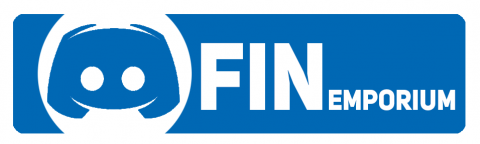

---
hide:
  - navigation
  - toc
  - path
---

<div class="oscar-hero" markdown>

  <div class="hero-logo-container">
    

    <div class="speech-bubble">
      <p><strong>O</strong>rganized <strong>S</strong>tudy <strong>C</strong>hoice & <strong>A</strong>cademic <strong>R</strong>oadmapper</p><br>
      <p class="speech-sub">Plan your semesters, avoid bad module choices, and stop juggling PDFs – directly in Discord.</p>
    </div>
  </div>

  <div class="hero-buttons">
    <a href="https://discord.com/invite/m4vQhrK" class="hero-btn btn-primary">Join FinEmporium</a>
    <a href="features/commands/" class="hero-btn btn-secondary">View Commands</a>
  </div>

   {{ project_badges_with_links() }}

  <div class="scroll-indicator" onclick="document.querySelector('.oscar-intro').scrollIntoView({behavior:'smooth'})">
    <span></span>
    <span></span>
    <span></span>
  </div>

</div>

<div class="oscar-intro" markdown>

<p style="text-align: center; font-size: 1.8em; font-weight: 500; color: #0068b4; margin-top: 0;">
  Made by students for students.
</p>

<p style="font-size: 2em; line-height: 1.5;">
  🔍 <strong>Search modules</strong> by name, CP, SWS &amp; exam type <br>
  📅 <strong>Build your personal study plan</strong><br>
  🗓️ <strong>Curriculum preview &amp; comparison</strong><br>
  - all in one place -
</p>

## **[Why OSCAR?](about_oscar.md)**

OSCAR is a Discord-based assistant that helps FIN students at Otto-von-Guericke-University Magdeburg plan their semesters and choose modules by turning complex catalogs, exam regulations, and scattered PDFs into one clear, accessible place.

<div class="grid" markdown>

!!! failure "The Problem"
    Finding module info as a FIN student is fragmented and time-consuming:

    * ❌ **Scattered sources** — exam regulations (PDFs), [module handbook](https://bookstack.cs.ovgu.de/), and [LSF portal](https://lsf.ovgu.de/) are all separate.
    * ❌ **Context switching** — students already discuss their study plans on Discord ([FinEmporium](https://farafin.de/studierende/fin-community/)), then switch to the browser and back.
    * ❌ **Screenshot chaos** — module details are shared as images in chat instead of structured data.
    * ❌ **Inefficient planning** leading to suboptimal module choices.

!!! success "The OSCAR Solution"
    OSCAR meets students where they already are — on Discord:

    * ✅ **One Platform:** search modules, filter by CP/SWS/exam type, and plan semesters without leaving Discord.
    * ✅ **Up-to-date:** Synced with official faculty data.
    * ✅ **Focused scope** — FIN modules only, no unreliable AI integrations, fewer but better features.
    * ✅ **Privacy-first** — study plan stays local. No messages stored, no profiles, no analytics.

</div>

</div>

## **Choose Your Path**

=== "For Students"

    ### **Your Personal Study Assistant**

    Plan your studies where you chat: OSCAR brings the official [module catalog](https://bookstack.cs.ovgu.de/) to Discord, helping you build your academic roadmap with ease.

    ??? note "Data Accuracy & Scope"
        The bot syncs module data regularly from the faculty's Nextcloud.
        However, always verify exam details in the official LSF/Prüfungsamt documents.

        **OSCAR is for personal planning only.** You must still register for courses, exams, and events through official platforms such as [LSF](https://lsf.ovgu.de), e-learning portals, or other university websites. OSCAR does not replace any official registration process.

    ## **Features**

    <div class="grid cards" markdown>

    -   🚀 **Get Started**
        ---
        Set up your course of study and semester. An interactive wizard guides you through the process.

        ```bash
        /start
        ```

        { width="400" .img-center }

    -   🔍 **Find Modules**
        ---
        Credit points (CP), exams and course content, with buttons to the LSF, the module handbook and the past exams. In a module channel `/here` opens the module the channel is named after.

        ```bash
        /module [name]
        /here
        ```

        { width="400" .img-center }
        { width="400" .img-center }

    -   🎯 **Smart Filters**
        ---
        Find modules that fit your CP, SWS, or Exam Type preferences.

        ```bash
        /filter
        ```

        { width="400" .img-center }

    -   📅 **Plan Semesters**
        ---
        Create, customize, and save your personal study roadmap.

        ```bash
        /semesterplan
        ```

        { width="400" .img-center }


    -   🗓️ **Standard Curriculum**
        ---
        View the official Regelstudienplan for your degree – see which modules are planned per semester at a glance.

        ```bash
        /standard_plan
        ```

        { width="400" .img-center }

    -   💬 **Send Feedback**
        ---
        Help us improve OSCAR with your suggestions and bug reports.

        ```bash
        /feedback
        ```
        { width="400" .img-center }

    </div>

    ### **More commands**

    | Command | What it does |
    | :--- | :--- |
    | `/here` | Opens the module the current channel is named after |
    | `/compare` | Puts two or three modules side by side |
    | `/rate`, `/klausuren` | Ratings and reviews by other students, and the past exam archives |
    | `/progress`, `/badges`, `/cohort` | Your credit points and milestones, and an anonymous comparison |
    | `/suggest` | Modules that fit your programme and your open credit points |
    | `/fristen` | Roughly what is due when in the semester |
    | `/studybuddy` | Find students who plan the same module, opt in only |
    | `/lms`, `/ansprechpartner` | The university portals, and who to ask |
    | `/codegolf` | A weekly programming puzzle |
    | `/my_data` | See, export and delete what OSCAR stores about you |
    | `/help` | Every command explained, in German and English |

    [View all Commands](features/commands.md){ .md-button .md-button--primary }


    ### **Getting Started**

    Follow these steps to get your personal study assistant running.

    === "Step 1: Get Discord"
        To use OSCAR, you need a **Discord account**. Discord is a free communication platform available on all devices.

        **Available on:**

        * 📱 **Mobile:** iOS, Android, [Volla OS](https://volla.online/en/index.php) and [GrapheneOS](https://grapheneos.org/)
        * 💻 **Computer:** Windows, macOS, Linux
        * 🌐 **Web Browser:** [discord.com](https://discord.com)

        **Set up Discord:**

        1.  **Already have Discord?** → Sign in with your existing account.
        2.  **New to Discord?** → Create a free account:
            * Go to [discord.com](https://discord.com)
            * Click "Sign up" and follow the steps
            * Verify your email address  → Done!

    === "Step 2: Join Server"
        The (unofficial) community for FIN students is the **FinEmporium**.

        { width="120" align="left" }

        **[Join FinEmporium Discord Server](https://discord.com/invite/m4vQhrK)**

        For more information about FinEmporium, see the [FIN-Community Page](https://farafin.de/en/students/fin-community/).

        ---

        !!! success "OSCAR is on FinEmporium"
            OSCAR runs on the FinEmporium server. Join it, type `/` in any channel and pick a command of OSCAR.

            [**Join the FinEmporium server**](https://discord.com/invite/m4vQhrK){ .md-button .md-button--primary }

    === "Step 3: Start OSCAR"
        Once you are on the server, you can add your **Course of Study** and **Semester**.

        Type this command in any text channel:
        ```
        /start
        ```

        *An interactive setup wizard will guide you through the process.*

        { width="400" .img-center }

    === "Step 4: Try it out"
        Three commands are enough for the first day:

        <div class="cmd-row" markdown>
        ```
        /module [name]
        ```
        Find a module: credit points, exams and content, with buttons to the LSF and the module handbook.
        </div>

        <div class="cmd-row" markdown>
        ```
        /semesterplan
        ```
        See the modules you saved, next to the standard curriculum of your semester.
        </div>

        <div class="cmd-row" markdown>
        ```
        /help
        ```
        Every other command explained. You can start most of them right from the menu.
        </div>

=== "For Developers"

    ### **Contribute to OSCAR**

    OSCAR is a Python project. We welcome contributions!

    <div class="grid cards" markdown>

    -   :fontawesome-brands-github: **Source Code**
        ---
        Clone the repository and start coding.
        [:octicons-arrow-right-24: Go to GitHub](https://github.com/emin-girimhanov/oscar-discord-bot)

    -   :material-bug: **Issue Tracker**
        ---
        Found a bug? Report it or pick up an issue.
        [:octicons-arrow-right-24: View Issues](https://github.com/emin-girimhanov/oscar-discord-bot/issues)

    -   :fontawesome-solid-book: **Architecture**
        ---
        Understand the database models and module system.
        [:octicons-arrow-right-24: See Developer Guide](developer/index.md)

    </div>

    The guides have every step. This page only says where to start.

    | You want to | Read |
    | :--- | :--- |
    | set the project up on your machine | [Setup & Install](developer/setup.md) |
    | run the bot in a container | [Run It Yourself](developer/selfhost.md) |
    | know how commits, branches and the pipeline work | [Git Workflow](developer/workflow.md) |
    | run and write tests | [Testing](developer/testing_guide.md) |

    ### **Resources**

    <div class="grid cards" markdown>

    -   :material-book-open-variant: **discord.py Docs**
        ---
        Official library reference for all Discord API interactions.
        [:octicons-arrow-right-24: discordpy.readthedocs.io](https://discordpy.readthedocs.io/en/stable/)

    -   :material-puzzle: **Discord Components**
        ---
        Reference for buttons, select menus, modals and other UI components.
        [:octicons-arrow-right-24: Discord Dev Docs](https://docs.discord.com/developers/components/reference)

    -   :material-rocket-launch: **Discord Quick Start**
        ---
        Getting started guide for building Discord bots.
        [:octicons-arrow-right-24: Getting Started](https://docs.discord.com/developers/quick-start/getting-started)

    -   :simple-discord: **Invite OSCAR**
        ---
        Add the running bot to a server of your own. It also runs on FinEmporium.
        [:octicons-arrow-right-24: Invite Bot](https://discord.com/oauth2/authorize?client_id=1549756119033847890&permissions=2147601408&scope=bot+applications.commands)

    </div>

    [View full Developer Guide](developer/index.md){ .md-button .md-button--primary }
    ---

=== "For Administrators"

    OSCAR can be self‑hosted on your own infrastructure. This section gives you everything you need to install, configure and operate the bot as a **server** admin.

    ### **Bot Management & Deployment**

    Tools and documentation for maintaining OSCAR on your own infrastructure.

    !!! info "OVGU Data Source Dependency"
        OSCAR currently fetches module data from **OVGU's Nextcloud Tables** instance.
        External self-hosting requires either access to the OVGU Nextcloud or setting up
        a compatible Nextcloud Tables instance with your own module data.

    ### **What you need**

    * a Discord bot token and the ID of your server
    * access to the module data in the Nextcloud Tables of the OVGU
    * Docker, or Python 3.12 or newer

    ### **Where it is explained**

    | You want to | Read |
    | :--- | :--- |
    | install and configure the bot | [Admin Guide](admin/index.md) |
    | run it in a container at home, back it up and harden it | [Run It Yourself](developer/selfhost.md) |
    | read the feedback students send | [Feedback Review](admin/feedback_review.md) |
    | know what is stored about students | [Privacy Policy](privacy.md) |

    ### **Resources**

    <div class="grid cards" markdown>

    -   :material-rocket-launch: **Discord Quick Start**
        ---
        Getting started guide for creating a bot application.
        [:octicons-arrow-right-24: Getting Started](https://docs.discord.com/developers/quick-start/getting-started)

    -   :simple-discord: **Invite OSCAR**
        ---
        Add the running bot to your server. It also runs on FinEmporium.
        [:octicons-arrow-right-24: Invite Bot](https://discord.com/oauth2/authorize?client_id=1549756119033847890&permissions=2147601408&scope=bot+applications.commands)

    </div>

    [View Full Admin Guide](admin/index.md){ .md-button .md-button--primary }
---

## **Quick Links**

<div class="grid cards" markdown>

- :fontawesome-brands-github: **OSCAR-REPO**
    ---

    View the source code and contribute.

    [:octicons-arrow-right-24: GitHub](https://github.com/emin-girimhanov/oscar-discord-bot)

- :material-school: **Faculty (FIN)**
    ---

    Official website of the Faculty.

    [:octicons-arrow-right-24: FIN Website](https://www.fin.ovgu.de/)

- :material-information-outline: **About OSCAR**
    ---

    Team, goals, and timeline.

    [:octicons-arrow-right-24: About OSCAR](about_oscar.md)

- :material-shield-account: **Privacy Policy**
    ---

    GDPR compliant data handling.

    [:octicons-arrow-right-24: Privacy Policy](privacy.md)

</div>

<br>

---

## **Contact the Project Authors**

If you have questions or need support, reach out to the team:
<div class="author-grid" markdown>

- **Christos Lachanas** <br> :material-server-network: *DevOps & API Integration* <br> <a data-email="Y2hyaXN0b3MubGFjaGFuYXNAc3Qub3ZndS5kZQ==" href="#">christos.lachanas [at] st.ovgu.de</a>
- **Malte Hedrich** <br> :material-brush: *Frontend & User Experience* <br> <a data-email="bWFsdGUuaGVkcmljaEBzdC5vdmd1LmRl" href="#">malte.hedrich [at] st.ovgu.de</a>
- **Malte Heiß** <br> :material-database: *Backend & Database Architecture* <br> <a data-email="bWFsdGUuaGVpc3NAc3Qub3ZndS5kZQ==" href="#">malte.heiss [at] st.ovgu.de</a>
- **Emin Girimhanov** <br> :material-file-document: *Backend & Documentation* <br> <a data-email="ZW1pbi5naXJpbWhhbm92QHN0Lm92Z3UuZGU=" href="#">emin.girimhanov [at] st.ovgu.de</a>

</div>
